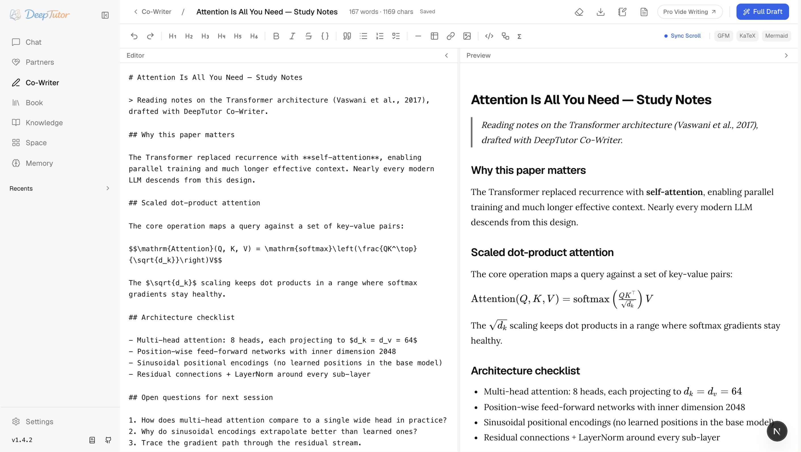

<div align="center">

<p align="center">&nbsp;</p>

# DeepTutor: Agent-Native Personalized Tutoring

<p align="center">
  <a href="https://deeptutor.info" target="_blank"></a>
</p>

<a href="https://trendshift.io/repositories/17099" target="_blank"></a>

<p align="center">
  <a href="README.md"></a>&nbsp;
  <a href="assets/README/README_CN.md"></a>&nbsp;
  <a href="assets/README/README_JA.md"></a>&nbsp;
  <a href="assets/README/README_ES.md"></a>&nbsp;
  <a href="assets/README/README_FR.md"></a>&nbsp;
  <a href="assets/README/README_AR.md"></a>&nbsp;
  <a href="assets/README/README_RU.md"></a>&nbsp;
  <a href="assets/README/README_HI.md"></a>&nbsp;
  <a href="assets/README/README_PT.md"></a>&nbsp;
  <a href="assets/README/README_TH.md"></a>&nbsp;
  <a href="assets/README/README_PL.md"></a>
</p>

[](https://www.python.org/downloads/)
[](https://nextjs.org/)
[](LICENSE)
[](https://github.com/HKUDS/DeepTutor/releases)
[](https://arxiv.org/abs/2604.26962)

[](https://discord.gg/eRsjPgMU4t)
[](./Communication.md)
[](https://github.com/HKUDS/DeepTutor/issues/78)

[Features](#-key-features) · [Get Started](#-get-started) · [Explore](#-explore-deeptutor) · [CLI](#%EF%B8%8F-deeptutor-cli--agent-native-interface) · [Ecosystem](#-ecosystem--open-to-the-skills-community) · [Community](#-community)

</div>

---

> 🤝 **We welcome any kinds of contributing!** Vote on roadmap items or propose new ones at [`Roadmap`](https://github.com/HKUDS/DeepTutor/issues/498), and see our [Contributing Guide](CONTRIBUTING.md) for branching strategy, coding standards, and how to get started.

### 📦 Releases

> **[2026.6.17]** [v1.4.6](https://github.com/HKUDS/DeepTutor/releases/tag/v1.4.6) — Consolidation across four surfaces: Space becomes a learning dashboard with importable **My Agents** and a top-level Memory, the **Knowledge Center** adds GraphRAG / PageIndex / LightRAG engines plus linked-KB and Obsidian mounts, Settings opens up document parsing / voice / image+video, and LLM capabilities are gated per assigned model.

> **[2026.6.14]** [v1.4.5](https://github.com/HKUDS/DeepTutor/releases/tag/v1.4.5) — Guided Learning rebuilt on the chat agent loop with a hard per-type mastery gate and a `/learning` dashboard, a new extensible loop-plugin framework, plus Markdown export / save-to-notebook for Partner conversations.

> **[2026.6.13]** [v1.4.4](https://github.com/HKUDS/DeepTutor/releases/tag/v1.4.4) — Install community skills from [ClawHub](https://clawhub.ai/) with `deeptutor skill install` behind a security gate, plus real in-browser DOCX/XLSX previews for knowledge-base files.

> **[2026.6.12]** [v1.4.3](https://github.com/HKUDS/DeepTutor/releases/tag/v1.4.3) — TutorBot becomes **Partners** on a production-grade IM pipeline (15 channels, live streaming), Chat moves to a single agent loop, real per-user isolation, and a rebuilt Visualize.

<details>
<summary><b>Past releases (more than 2 weeks ago)</b></summary>

> **[2026.5.28]** [v1.4.2](https://github.com/HKUDS/DeepTutor/releases/tag/v1.4.2) — Stability + polish: Gemini 2.5+ unblocked across Visualize and Chat, auth-routing fix (#485), smooth-streaming chat UX, a Recents sidebar, and Lemonade local-provider support.

> **[2026.5.27]** [v1.4.1](https://github.com/HKUDS/DeepTutor/releases/tag/v1.4.1) — Security + stability: TutorBot tool sandbox locked down, per-user resource isolation, multimodal image fallback, an HTTP/SSE API for TutorBots, and a v1.4.0 chat regression fix.

> **[2026.5.22]** [v1.4.0](https://github.com/HKUDS/DeepTutor/releases/tag/v1.4.0) — GA cut of v1.4: Auto Mode, three-layer Memory, agentic Deep Research / Solve / Question, LlamaIndex RAG refactor, Visualize/Animator merge, and restart-safe turn runtime.

> **[2026.5.21]** [v1.4.0-beta](https://github.com/HKUDS/DeepTutor/releases/tag/v1.4.0-beta) — Three-layer Memory workbench (L1/L2/L3), every chat capability rebuilt on a single agentic engine, LlamaIndex-only RAG, and a unified Settings + Capabilities surface.

> **[2026.5.10]** [v1.3.10](https://github.com/HKUDS/DeepTutor/releases/tag/v1.3.10) — Remote Docker CORS recovery, `DISABLE_SSL_VERIFY` across SDK providers, safer code-block citations, and optional Matrix E2EE add-on.

> **[2026.5.9]** [v1.3.9](https://github.com/HKUDS/DeepTutor/releases/tag/v1.3.9) — TutorBot Zulip and NVIDIA NIM support, safer thinking-model routing, `deeptutor start`, sidebar tooltips, and session-store parity.

> **[2026.5.8]** [v1.3.8](https://github.com/HKUDS/DeepTutor/releases/tag/v1.3.8) — Optional multi-user deployments with isolated user workspaces, admin grants, auth routes, and scoped runtime access.

> **[2026.5.4]** [v1.3.7](https://github.com/HKUDS/DeepTutor/releases/tag/v1.3.7) — Thinking-model/provider fixes, visible Knowledge index history, and safer Co-Writer clear/template editing.

> **[2026.5.3]** [v1.3.6](https://github.com/HKUDS/DeepTutor/releases/tag/v1.3.6) — Catalog-based model selection for chat and TutorBot, safer RAG re-indexing, OpenAI Responses token-limit fixes, and Skills editor validation.

> **[2026.5.2]** [v1.3.5](https://github.com/HKUDS/DeepTutor/releases/tag/v1.3.5) — Smoother local launch settings, safer RAG queries, cleaner local embedding auth, and Settings dark-mode polish.

> **[2026.5.1]** [v1.3.4](https://github.com/HKUDS/DeepTutor/releases/tag/v1.3.4) — Book page chat persistence and rebuild flows, chat-to-book references, stronger language/reasoning handling, RAG document extraction hardening.

> **[2026.4.30]** [v1.3.3](https://github.com/HKUDS/DeepTutor/releases/tag/v1.3.3) — NVIDIA NIM + Gemini embedding support, unified Space context for chat history/skills/memory, session snapshots, RAG re-index resilience.

> **[2026.4.29]** [v1.3.2](https://github.com/HKUDS/DeepTutor/releases/tag/v1.3.2) — Transparent embedding endpoint URLs, RAG re-index resilience for invalid persisted vectors, memory cleanup for thinking-model output, Deep Solve runtime fix.

> **[2026.4.28]** [v1.3.1](https://github.com/HKUDS/DeepTutor/releases/tag/v1.3.1) — Stability: safer RAG routing & embedding validation, Docker persistence, IME-safe input, Windows/GBK robustness.

> **[2026.4.27]** [v1.3.0](https://github.com/HKUDS/DeepTutor/releases/tag/v1.3.0) — Versioned KB indexes with re-index workflow, rebuilt Knowledge workspace, embedding auto-discovery with new adapters, Space hub.

> **[2026.4.25]** [v1.2.5](https://github.com/HKUDS/DeepTutor/releases/tag/v1.2.5) — Persistent chat attachments with file-preview drawer, attachment-aware capability pipelines, TutorBot Markdown export.

> **[2026.4.25]** [v1.2.4](https://github.com/HKUDS/DeepTutor/releases/tag/v1.2.4) — Text/code/SVG attachments, one-command Setup Tour, Markdown chat export, compact KB management UI.

> **[2026.4.24]** [v1.2.3](https://github.com/HKUDS/DeepTutor/releases/tag/v1.2.3) — Document attachments (PDF/DOCX/XLSX/PPTX), reasoning thinking-block display, Soul template editor, Co-Writer save-to-notebook.

> **[2026.4.22]** [v1.2.2](https://github.com/HKUDS/DeepTutor/releases/tag/v1.2.2) — User-authored Skills system, chat input performance overhaul, TutorBot auto-start, Book Library UI, visualization fullscreen.

> **[2026.4.21]** [v1.2.1](https://github.com/HKUDS/DeepTutor/releases/tag/v1.2.1) — Per-stage token limits, Regenerate response across all entry points, RAG & Gemma compatibility fixes.

> **[2026.4.20]** [v1.2.0](https://github.com/HKUDS/DeepTutor/releases/tag/v1.2.0) — Book Engine "living book" compiler, multi-document Co-Writer, interactive HTML visualizations, Question Bank @-mention.

> **[2026.4.18]** [v1.1.2](https://github.com/HKUDS/DeepTutor/releases/tag/v1.1.2) — Schema-driven Channels tab, RAG single-pipeline consolidation, externalized chat prompts.

> **[2026.4.17]** [v1.1.1](https://github.com/HKUDS/DeepTutor/releases/tag/v1.1.1) — Universal "Answer now", Co-Writer scroll sync, unified settings panel, streaming Stop button.

> **[2026.4.15]** [v1.1.0](https://github.com/HKUDS/DeepTutor/releases/tag/v1.1.0) — LaTeX block math overhaul, LLM diagnostic probe, Docker + local LLM guidance.

> **[2026.4.14]** [v1.1.0-beta](https://github.com/HKUDS/DeepTutor/releases/tag/v1.1.0-beta) — Bookmarkable sessions, Snow theme, WebSocket heartbeat & auto-reconnect, embedding registry overhaul.

> **[2026.4.13]** [v1.0.3](https://github.com/HKUDS/DeepTutor/releases/tag/v1.0.3) — Question Notebook with bookmarks & categories, Mermaid in Visualize, embedding mismatch detection, Qwen/vLLM compatibility, LM Studio & llama.cpp support, and Glass theme.

> **[2026.4.11]** [v1.0.2](https://github.com/HKUDS/DeepTutor/releases/tag/v1.0.2) — Search consolidation with SearXNG fallback, provider switch fix, and frontend resource leak fixes.

> **[2026.4.10]** [v1.0.1](https://github.com/HKUDS/DeepTutor/releases/tag/v1.0.1) — Visualize capability (Chart.js/SVG), quiz duplicate prevention, and o4-mini model support.

> **[2026.4.10]** [v1.0.0-beta.4](https://github.com/HKUDS/DeepTutor/releases/tag/v1.0.0-beta.4) — Embedding progress tracking with rate-limit retry, cross-platform dependency fixes, and MIME validation fix.

> **[2026.4.8]** [v1.0.0-beta.3](https://github.com/HKUDS/DeepTutor/releases/tag/v1.0.0-beta.3) — Native OpenAI/Anthropic SDK (drop litellm), Windows Math Animator support, robust JSON parsing, and full Chinese i18n.

> **[2026.4.7]** [v1.0.0-beta.2](https://github.com/HKUDS/DeepTutor/releases/tag/v1.0.0-beta.2) — Hot settings reload, MinerU nested output, WebSocket fix, and Python 3.11+ minimum.

> **[2026.4.4]** [v1.0.0-beta.1](https://github.com/HKUDS/DeepTutor/releases/tag/v1.0.0-beta.1) — Agent-native architecture rewrite (~200k lines): Tools + Capabilities plugin model, CLI & SDK, TutorBot, Co-Writer, Guided Learning, and persistent memory.

> **[2026.1.23]** [v0.6.0](https://github.com/HKUDS/DeepTutor/releases/tag/v0.6.0) — Session persistence, incremental document upload, flexible RAG pipeline import, and full Chinese localization.

> **[2026.1.18]** [v0.5.2](https://github.com/HKUDS/DeepTutor/releases/tag/v0.5.2) — Docling support for RAG-Anything, logging system optimization, and bug fixes.

> **[2026.1.15]** [v0.5.0](https://github.com/HKUDS/DeepTutor/releases/tag/v0.5.0) — Unified service configuration, RAG pipeline selection per knowledge base, question generation overhaul, and sidebar customization.

> **[2026.1.9]** [v0.4.0](https://github.com/HKUDS/DeepTutor/releases/tag/v0.4.0) — Multi-provider LLM & embedding support, new home page, RAG module decoupling, and environment variable refactor.

> **[2026.1.5]** [v0.3.0](https://github.com/HKUDS/DeepTutor/releases/tag/v0.3.0) — Unified PromptManager architecture, GitHub Actions CI/CD, and pre-built Docker images on GHCR.

> **[2026.1.2]** [v0.2.0](https://github.com/HKUDS/DeepTutor/releases/tag/v0.2.0) — Docker deployment, Next.js 16 & React 19 upgrade, WebSocket security hardening, and critical vulnerability fixes.

</details>

### 📰 News

- **2026-05-22** 🌐 Official docs site live at [**deeptutor.info**](https://deeptutor.info/) — guides, references, and capability tours in one place.
- **2026-04-19** 🎉 20k stars in 111 days! Thank you for the support toward truly personalized, intelligent tutoring.
- **2026-04-10** 📄 Our paper is live on arXiv — read the [preprint](https://arxiv.org/abs/2604.26962) for the design and ideas behind DeepTutor.
- **2026-02-06** 🚀 10k stars in just 39 days! A huge thank you to our incredible community.
- **2026-01-01** 🎊 Happy New Year! Join our [Discord](https://discord.gg/eRsjPgMU4t), [WeChat](https://github.com/HKUDS/DeepTutor/issues/78), or [Discussions](https://github.com/HKUDS/DeepTutor/discussions) — let's shape DeepTutor together.
- **2025-12-29** 🎓 DeepTutor is officially released!

## ✨ Key Features

DeepTutor is an agent-native learning workspace that connects tutoring, problem solving, quiz generation, research, visualization, and mastery practice in one extensible system.

- **One runtime for every mode** — Chat, Solve, Quiz, Research, Visualize, and Mastery Path share the same tutoring engine, so context can move with the learner.
- **Connected learning context** — Knowledge Bases, books, Co-Writer drafts, Space assets, notebooks, and Memory stay available across workflows instead of living in isolated tools.
- **Extensible tools and skills** — Built-in tools, MCP tools, built-in skills, and installable community skills let DeepTutor grow with new learning workflows.
- **Inspectable memory** — L1 traces, L2 surface summaries, and L3 synthesis make personalization visible, editable, and grounded in prior activity.
- **Persistent Partners** — IM-connected companions run on the same agent loop, each with its own soul, channels, workspace, and assigned library.

---

## 🚀 Get Started

DeepTutor ships four installation paths. They all share one workspace layout: settings live in `data/user/settings/` under the directory you launch from (or under `DEEPTUTOR_HOME` / `deeptutor start --home` if you set one explicitly). For the full app, the recommended flow is **pick a workspace directory → install → `deeptutor init` → `deeptutor start`**.

<details>
<summary><b>Option 1 — Install From PyPI</b> · full local Web app + CLI, no clone required</summary>

Full local Web app + CLI, no clone required. Needs **Python 3.11+** and a **Node.js 20+** runtime on PATH (the packaged Next.js standalone server is spawned by `deeptutor start`).

```bash
mkdir -p my-deeptutor && cd my-deeptutor
pip install -U deeptutor
deeptutor init     # prompts for ports + LLM provider + optional embedding
deeptutor start    # starts backend + frontend; keep the terminal open
```

`deeptutor init` prompts for backend port (default `8001`), frontend port (default `3782`), LLM provider / base URL / API key / model, and an optional embedding provider for Knowledge Base / RAG.

After `deeptutor start`, open the frontend URL printed in the terminal — by default [http://127.0.0.1:3782](http://127.0.0.1:3782). Press `Ctrl+C` in that terminal to stop both backend and frontend. Skipping `deeptutor init` is fine for a quick trial; the app boots with default ports and empty model settings, configure them later in **Settings → Models**.

</details>

<details>
<summary><b>Option 2 — Install From Source</b> · develop against a checkout</summary>

For development against a checkout. Use **Python 3.11+** and **Node.js 22 LTS** to match CI and Docker.

```bash
git clone https://github.com/HKUDS/DeepTutor.git
cd DeepTutor

# Create a venv (macOS/Linux). Windows PowerShell:
#   py -3.11 -m venv .venv ; .\.venv\Scripts\Activate.ps1
python3 -m venv .venv && source .venv/bin/activate
python -m pip install --upgrade pip

# Install backend + frontend deps
python -m pip install -e .
( cd web && npm ci --legacy-peer-deps )

deeptutor init
deeptutor start
```

Source installs run Next.js in dev mode against the local `web/` directory; everything else (config layout, ports, stop with `Ctrl+C`) matches Option 1.

<details>
<summary><b>Conda environment</b> (instead of <code>venv</code>)</summary>

```bash
conda create -n deeptutor python=3.11
conda activate deeptutor
python -m pip install --upgrade pip
```

</details>

<details>
<summary><b>Optional install extras</b> — dev / partners / matrix / math-animator</summary>

```bash
pip install -e ".[dev]"             # tests/lint tools
pip install -e ".[partners]"        # Partner IM channel SDKs + MCP client
pip install -e ".[matrix]"          # Matrix channel without E2EE/libolm
pip install -e ".[matrix-e2e]"      # Matrix E2EE; requires libolm
pip install -e ".[math-animator]"   # Manim addon; requires LaTeX/ffmpeg/system libs
```

</details>

<details>
<summary><b>Frontend dependency tweaks & dev-server troubleshooting</b></summary>

**Changing frontend dependencies:** run `npm install --legacy-peer-deps` to refresh `web/package-lock.json`, then commit both `web/package.json` and `web/package-lock.json`.

**Stuck dev server:** if `deeptutor start` reports an existing frontend that isn't responding, stop the PID it prints. If no Next.js process is actually running, the lock files are stale — remove them and retry:

```bash
rm -f web/.next/dev/lock web/.next/lock
deeptutor start
```

</details>

</details>

<details>
<summary><b>Option 3 — Docker</b> · one self-contained container</summary>

One container for the full Web app. Images on GitHub Container Registry:

- `ghcr.io/hkuds/deeptutor:latest` — stable release
- `ghcr.io/hkuds/deeptutor:pre` — pre-release, when available

```bash
docker run --rm --name deeptutor \
  -p 127.0.0.1:3782:3782 \
  -p 127.0.0.1:8001:8001 \
  -v deeptutor-data:/app/data \
  ghcr.io/hkuds/deeptutor:latest
```

> ⚠️ **Map both `3782` and `8001`.** `3782` serves the web UI; `8001` is the FastAPI backend that your browser calls directly — there is no in-container proxy. Skip the `8001` mapping and the page still loads, but **Settings** shows "Backend unreachable" and stays unusable.

Open [http://127.0.0.1:3782](http://127.0.0.1:3782). The container creates `/app/data/user/settings/*.json` on first boot; configure model providers from the Web Settings page. Config, API keys, logs, workspace files, memory, and knowledge bases persist in the `deeptutor-data` volume.

- **Different host ports:** change the left side of each `-p host:container` mapping (e.g. `-p 127.0.0.1:8088:3782`). If you change container-side ports in `/app/data/user/settings/system.json`, restart and update the right side of each mapping to match.
- **Detached:** add `-d`, then `docker logs -f deeptutor` to follow, `docker stop deeptutor` to stop, `docker rm deeptutor` before reusing the name. The `deeptutor-data` volume keeps your settings and workspace across restarts.

**Remote Docker / reverse proxy:** the Web UI runs in the browser, so the
browser needs a backend URL it can reach. For remote servers, open
**Settings -> Network** or edit `data/user/settings/system.json`:

```json
{
  "next_public_api_base_external": "https://deeptutor.example.com"
}
```

`public_api_base` is accepted as a compatibility alias and is normalized into
`next_public_api_base_external` on save. CORS uses frontend **origins**, not API
URLs. With auth disabled, DeepTutor permits normal HTTP/HTTPS browser origins by
default. With auth enabled, add exact frontend origins:

```json
{
  "cors_origins": ["https://deeptutor.example.com"]
}
```

<details>
<summary><b>Connecting to Ollama / LM Studio / llama.cpp / vLLM / Lemonade on the host</b></summary>

Inside Docker, `localhost` is the container itself, not your host machine. To reach a model service running on the host, use the host gateway (recommended):

```bash
docker run --rm --name deeptutor \
  -p 127.0.0.1:3782:3782 -p 127.0.0.1:8001:8001 \
  --add-host=host.docker.internal:host-gateway \
  -v deeptutor-data:/app/data \
  ghcr.io/hkuds/deeptutor:latest
```

Then in **Settings → Models**, point the provider Base URL at `host.docker.internal`:

- Ollama LLM: `http://host.docker.internal:11434/v1`
- Ollama embedding: `http://host.docker.internal:11434/api/embed`
- LM Studio: `http://host.docker.internal:1234/v1`
- llama.cpp: `http://host.docker.internal:8080/v1`
- Lemonade: `http://host.docker.internal:13305/api/v1`

Docker Desktop (macOS/Windows) usually resolves `host.docker.internal` without `--add-host`. On Linux, the flag is the portable way to create that hostname on modern Docker Engine.

**Linux alternative — host networking:** add `--network=host` and drop the `-p` flags. The container shares the host network directly, so open [http://127.0.0.1:3782](http://127.0.0.1:3782) (or the `frontend_port` in `system.json`), and host services can be reached with normal localhost URLs like `http://127.0.0.1:11434/v1`. Note that host networking exposes container ports directly on the host and may conflict with existing services.

</details>

</details>

<details>
<summary><b>Option 4 — CLI Only</b> · no Web UI, from a source checkout</summary>

When you don't need the Web UI. The CLI-only package is installed from a source checkout, not from PyPI.

```bash
git clone https://github.com/HKUDS/DeepTutor.git
cd DeepTutor

# Create a venv (macOS/Linux). Windows PowerShell:
#   py -3.11 -m venv .venv-cli ; .\.venv-cli\Scripts\Activate.ps1
python3 -m venv .venv-cli && source .venv-cli/bin/activate
python -m pip install --upgrade pip

python -m pip install -e ./packaging/deeptutor-cli
deeptutor init --cli
deeptutor chat
```

`deeptutor init --cli` shares the same `data/user/settings/` layout as the full app but skips the backend/frontend port prompts and defaults embeddings to **off** (choose `Yes` if you plan to use `deeptutor kb …` or RAG tools). It still writes a complete runtime layout (`system.json`, `auth.json`, `integrations.json`, `model_catalog.json`, `main.yaml`, `agents.yaml`) and still prompts for the active LLM provider and model.

<details>
<summary><b>Common commands</b></summary>

```bash
deeptutor chat                                          # interactive REPL
deeptutor chat --capability deep_solve --tool rag --kb my-kb
deeptutor run chat "Explain Fourier transform"
deeptutor run deep_solve "Solve x^2 = 4" --tool rag --kb my-kb
deeptutor kb create my-kb --doc textbook.pdf
deeptutor memory show
deeptutor config show
```

</details>

The local `deeptutor-cli` install ships no Web assets or server dependencies. Keep the source checkout around — the editable install points to it. To add the Web app later, install the PyPI package (Option 1) and run `deeptutor init` + `deeptutor start` from the same workspace.

</details>

<details>
<summary><b>Code Execution Sandbox (office skills)</b> · running model-generated code for docx / pdf / pptx / xlsx</summary>

The built-in office skills — **docx / pdf / pptx / xlsx** — work by having the
model write a short Python script (`python-docx`, `reportlab`, `openpyxl`, …),
run it through the `exec` / `code_execution` tools, and hand back a download URL.
Those tools mount whenever a sandbox backend is active, which it is **by default**
in every deployment shape:

- **Local (Option 1 / 2) and Docker (Option 3, single container):** a restricted
  subprocess sandbox runs the model's code (on the host locally, or inside the
  container under Docker — the container being its own isolation boundary).
- **docker-compose:** routed instead to a hardened, least-privileged **runner
  sidecar** (`Dockerfile.runner`) via `DEEPTUTOR_SANDBOX_RUNNER_URL` — the
  strongest posture, and preferred automatically when present.

The subprocess sandbox is controlled by the `sandbox_allow_subprocess` setting in
`data/user/settings/system.json` (default `true`). Running model-generated code
on your host is a real trust decision — set it to `false` (or export
`DEEPTUTOR_SANDBOX_ALLOW_SUBPROCESS=0`) to disable host-side execution, at the
cost of the office skills no longer being able to produce files.

</details>

<details>
<summary><b>Configuration reference</b> — config files under <code>data/user/settings/</code> (JSON/YAML)</summary>

Everything under `data/user/settings/` is plain JSON/YAML. The **Settings** page in the browser is the recommended editor.

| File | Purpose |
|:---|:---|
| `model_catalog.json` | LLM, embedding, and search provider profiles; API keys; active models |
| `system.json` | Backend/frontend ports, public API base, CORS, SSL verification, attachment directory |
| `auth.json` | Optional auth toggle, username, password hash, token/cookie settings |
| `integrations.json` | Optional PocketBase and sidecar integration settings |
| `interface.json` | UI language / theme / sidebar preferences |
| `main.yaml` | Runtime behavior defaults and path injection |
| `agents.yaml` | Capability/tool temperature and token settings |

Project-root `.env` is **not** read as an application config file. For a minimal model setup, open **Settings → Models**, add an LLM profile (Base URL / API key / model name), and save. Add an embedding profile only if you plan to use Knowledge Base / RAG features.

</details>

## 📖 Explore DeepTutor

Start with the main surfaces you will use day to day: Chat, Partners, Co-Writer, Book, Knowledge, Space, Memory, and Settings. The tour then covers Multi-User deployments for shared, isolated workspaces.

<div align="center">

</div>

<details>
<summary><b>🏗️ System architecture</b></summary>

<div align="center">

</div>

</details>

<details>
<summary><b>💬 Chat — The Agent Loop You Actually Use</b></summary>

Chat is the default capability and the place where most work begins. A single thread can talk normally, call tools, ground itself in selected knowledge bases, read attachments, write notebook records, and continue with the same source inventory across turns.

<div align="center">

</div>

The current loop is deliberately simple: the model thinks in rounds, calls tools when useful, observes the tool results, and finishes when it has enough evidence. User-toggleable tools are `brainstorm`, `web_search`, `paper_search`, and `reason`; contextual tools such as `rag`, `read_source`, `read_memory`, `write_memory`, `read_skill`, `load_tools`, `exec`, `web_fetch`, `ask_user`, `list_notebook`, `write_note`, and `github` mount when the turn has the right context.

Chat is also the launch point for deeper capabilities: `deep_solve` for worked reasoning, `deep_question` for question generation, `deep_research` for cited reports, `visualize` and `math_animator` for visual outputs, and `mastery_path` for learning-plan flows.

</details>

<details>
<summary><b>🤝 Partner — Persistent Companions on the Same Brain</b></summary>

<div align="center">

</div>

Partners replace the older TutorBot engine with a cleaner model: every inbound web or IM message becomes a normal ChatOrchestrator turn inside a partner-scoped workspace. There is no separate bot brain to keep in sync.

<div align="center">

</div>

Each partner has a `SOUL.md`, model selection, channels, tool policy, and assigned library. Knowledge bases, skills, and notebooks are copied into `data/partners/<id>/workspace/`, so the same RAG, skill, notebook, and memory tools work without special cases.

<div align="center">

</div>

The channel layer is schema-driven and can connect to IM platforms such as Feishu, Telegram, Slack, DingTalk, QQ/Napcat, WeCom, WhatsApp, Zulip, Matrix, and Microsoft Teams depending on installed extras and configured credentials.

</details>

<details>
<summary><b>✍️ Co-Writer — Selection-Aware Markdown Drafting</b></summary>

<div align="center">

</div>

Co-Writer is a split-view Markdown workspace for reports, tutorials, notes, and long-form learning artifacts. Documents autosave, render a live preview, and can be saved back into notebooks when the draft becomes reusable context.

Select text and ask DeepTutor to rewrite, expand, or shorten it. The edit agent keeps a trace of tool calls and can ground an edit in a knowledge base or web evidence, so Co-Writer behaves more like an editor with retrieval than a detached text box.

</details>

<details>
<summary><b>📖 Book — Living Books from Your Materials</b></summary>

<p align="center">

&nbsp;

&nbsp;

</p>

Book turns selected sources into interactive learning material. A book can start from knowledge bases, notebooks, question banks, or chat history; the creation flow proposes a structure before content is generated, so users can review the shape instead of accepting a blind one-shot output.

The BookEngine compiles pages into typed blocks: text, sections, callouts, quizzes, flash cards, timelines, code, figures, interactive HTML, animations, concept graphs, deep dives, and user notes. Maintenance commands such as `deeptutor book health` and `deeptutor book refresh-fingerprints` help detect when source knowledge has drifted from compiled pages.

</details>

<details>
<summary><b>📚 Knowledge — Versioned RAG Libraries</b></summary>

<div align="center">

</div>

Knowledge Bases are the document collections behind RAG. The current stack is LlamaIndex-only, with a flat `version-N` storage layout keyed by embedding signature. Re-indexing preserves prior versions and avoids clobbering a working index while new documents are processed.

The web workspace exposes files, upload, index versions, and settings. The CLI mirrors the same lifecycle with `deeptutor kb list`, `info`, `create`, `add`, `search`, `set-default`, and `delete`.

</details>

<details>
<summary><b>🌐 Space — Skills, Personas, and Reusable Context</b></summary>

<div align="center">

</div>

Space is the library layer for reusable context. It brings together user-authored skills, personas, notebooks, chat history, and question-bank style assets so the agent can be steered with deliberate context instead of ad hoc prompting.

Skills are stored as `SKILL.md` files under the user workspace and can be tagged, edited, or kept read-only when they are built in. Personas follow the same idea for role and voice. These assets can be assigned to partners, referenced in chat, and reused across learning workflows.

</details>

<details>
<summary><b>🧠 Memory — Inspectable Personalization</b></summary>

<div align="center">

</div>

Memory is a three-layer system rooted in the active user workspace: `trace/<surface>/<date>.jsonl` for L1 event traces, `L2/<surface>.md` for per-surface facts, and `L3/<recent|profile|scope|preferences>.md` for cross-surface synthesis.

<div align="center">

</div>

The supported memory surfaces are `chat`, `notebook`, `quiz`, `kb`, `book`, `tutorbot`, and `cowriter`. The legacy `tutorbot` surface name remains in the memory layer for compatibility even though the product-facing companion model is now Partners. The workbench lets you inspect, edit, run consolidation, and use the graph to trace synthesized claims back to their supporting facts and raw events.

</details>

<details>
<summary><b>⚙️ Settings — One Control Plane</b></summary>

<div align="center">

</div>

Settings is the operational control plane. It covers appearance, network ports and external API base, LLM and embedding catalogs, search providers, MinerU parsing, capability budgets, memory cadence, MCP servers, built-in tools, and the enabled optional tool list.

Most settings use a draft-and-apply flow so users can test providers before committing them. Project-root `.env` files are intentionally ignored; runtime configuration lives under `data/user/settings/*.json` unless `DEEPTUTOR_HOME` or `deeptutor start --home` points the app elsewhere.

</details>

<details>
<summary><b>👥 Multi-User — Shared Deployments</b> · optional auth, isolated per-user workspaces</summary>

<div align="center">

</div>

Authentication is **off by default** — DeepTutor runs single-user. Turn it on and one `data/` tree hosts an admin workspace, isolated per-user workspaces, and partner workspaces side by side:

```text
data/
├── user/                    # Admin workspace + global settings
├── users/<uid>/             # Per-user scope: chat history, memory, notebooks, KBs
├── partners/<id>/workspace/ # Partner (synthetic-user) scope
└── system/                  # auth/users.json · grants/<uid>.json · audit/usage.jsonl
```

The **first registered user becomes admin** and owns model catalogs, provider credentials, shared knowledge bases, skills, and per-user grants. Everyone else gets an isolated workspace and a redacted Settings page — admin-assigned models, KBs, and skills show up as scoped, read-only options, never as raw API keys.

**Enable it:** turn auth on in `data/user/settings/auth.json`, restart `deeptutor start`, register the first admin at `/register`, then add users from `/admin/users` and assign models, KBs, skills, tool/MCP policy, and code-execution access through grants.

> PocketBase stays a single-user integration — keep `integrations.pocketbase_url` blank for multi-user deployments unless you've wired up an external user store.

</details>

## ⌨️ DeepTutor CLI — Agent-Native Interface

One `deeptutor` binary, two ways in: an interactive **REPL** for people who live in the terminal, and structured **JSON** for other agents that drive DeepTutor as a tool. Same capabilities, tools, and knowledge bases either way.

<details>
<summary><b>Drive it yourself</b></summary>

`deeptutor chat` opens an interactive REPL; `deeptutor run <capability> "<message>"` fires a single turn and exits. Both speak the same `--capability`, `--tool`, `--kb`, and `--config` flags.

```bash
deeptutor chat                                              # interactive REPL
deeptutor chat --capability deep_solve --kb my-kb --tool rag
deeptutor run chat "Explain the Fourier transform" --tool rag --kb textbook
deeptutor run deep_research "Survey 2026 papers on RAG" \
  --config mode=report --config depth=standard
```

Everything the Web app does is here too — knowledge bases (`kb`), sessions (`session`), partners (`partner`), skills (`skill`), notebooks, memory, and config. Full list below.

</details>

<details>
<summary><b>Let an agent drive it</b></summary>

DeepTutor is built to be *operated by another agent*. Add `--format json` to any `run` and each turn streams **NDJSON — one event per line** (`content`, `tool_call`, `tool_result`, `done`, …), every line tagged with its `session_id`. Runs are headless-safe: an `ask_user` pause with no TTY auto-resolves with an empty reply instead of hanging.

```bash
# One shot, machine-readable
deeptutor run deep_solve "Find d/dx[sin(x^2)]" --tool reason --format json

# Chain turns in one stateful session — capture the id, reuse it
SID=$(deeptutor run deep_research "Survey 2026 papers on RAG" \
  --config mode=report --config depth=standard --format json \
  | jq -r 'select(.type=="done").session_id')
deeptutor run deep_question "Quiz me on that survey" --session "$SID" --format json
```

The repo ships a root [`SKILL.md`](SKILL.md) — a ~150-line handover doc that teaches any tool-using LLM the whole surface in one read. Hand it to Claude Code, Codex, or OpenCode (they pick up `SKILL.md` automatically), or wrap `deeptutor run` as a tool in a LangChain / AutoGen loop. Full recipes: [Agent Handoff](https://deeptutor.info/docs/cli/agent-handoff/).

</details>

<details>
<summary><b>Command reference</b></summary>

| Command | Description |
|:---|:---|
| `deeptutor init` | Create or update `data/user/settings` for the current workspace |
| `deeptutor start [--home PATH]` | Launch backend + frontend together |
| `deeptutor serve [--port PORT]` | Start only the FastAPI backend |
| `deeptutor run <capability> <message>` | Run a single capability turn (`chat`, `deep_solve`, `deep_question`, `deep_research`, `visualize`, `math_animator`, `mastery_path`); add `--format json` for NDJSON output |
| `deeptutor chat` | Interactive REPL with capability, tool, KB, notebook, and history controls |
| `deeptutor partner list/create/start/stop` | Manage IM-connected partners |
| `deeptutor kb list/info/create/add/search/set-default/delete` | Manage LlamaIndex knowledge bases |
| `deeptutor skill search/install/list/remove` | Manage skills and install from hubs (`clawhub:<slug>`, see Ecosystem) |
| `deeptutor memory show/clear` | Inspect L2/L3 memory docs or clear L1/all memory |
| `deeptutor session list/show/open/rename/delete` | Manage shared sessions |
| `deeptutor notebook list/create/show/add-md/replace-md/remove-record` | Manage notebooks from Markdown files |
| `deeptutor book list/health/refresh-fingerprints` | Inspect books and refresh source fingerprints |
| `deeptutor plugin list/info` | Inspect registered tools and capabilities |
| `deeptutor config show` | Print configuration summary |
| `deeptutor provider login <provider>` | Provider auth (`openai-codex` OAuth login; `github-copilot` validates an existing Copilot auth session) |

</details>

<details>
<summary><b>CLI-only distribution</b></summary>

The CLI-only package lives in `packaging/deeptutor-cli`. In this checkout, install it from source:

```bash
python -m pip install -e ./packaging/deeptutor-cli
```

It isn't published to PyPI yet, so the main [Get Started](#-get-started) section keeps the source-install path.

</details>

## 🧩 Ecosystem — Open to the Skills Community

DeepTutor skills use the open **Agent-Skills** format, so any compatible community registry becomes a source for your library. [ClawHub](https://clawhub.ai/) ships wired in as the default hub.

<details>
<summary><b>How it works</b></summary>

A DeepTutor skill is just a folder with a `SKILL.md` playbook (YAML frontmatter + markdown) and optional reference files — the same open format used across the wider agent ecosystem. Nothing about it is DeepTutor-specific, so any registry that speaks the format is a first-class source for your skill library — no bespoke packaging, no lock-in.

Four commands cover the whole lifecycle:

```bash
deeptutor skill search "<query>"             # search a connected hub
deeptutor skill install <slug>               # fetch → verify → register (clawhub by default)
deeptutor skill install <hub>:<slug>@<ver>   # <hub>:<slug> picks the hub; @ pins a version
deeptutor skill list                         # local skills with their hub provenance
```

Add more registries in `settings/skill_hubs.json`: a `type: "clawhub"` entry points at any compatible HTTP API, while `type: "command"` wraps whatever fetch CLI a registry ships — both feed the same import gate.

Whatever the source, every import passes the **same safety gate** before anything touches your workspace:

- the registry's **security verdict** is checked first — flagged packages are refused unless you pass `--allow-unverified`;
- archives are extracted defensively (zip-slip / zip-bomb guards) behind a text/script **suffix whitelist**, so binaries never land in the workspace;
- frontmatter is normalized to DeepTutor's schema and `always:` is **stripped**, so a downloaded skill can never force itself into every system prompt;
- provenance — hub, version, verdict, and install time — is written to `.hub-lock.json` for audits and updates.

In multi-user deployments, installing is admin-only: a new skill lands in the admin catalog and stays invisible to other users until a grant assigns it, so an admin can vet it before rolling it out.

</details>

<details>
<summary><b>With ClawHub</b></summary>

Say you want a skill that turns git history into release notes. Search the default hub, install the match, and confirm it landed:

```bash
deeptutor skill search "git release notes"   # → git-release-notes (Git Release Notes)
deeptutor skill install git-release-notes    # fetch → verify → register
deeptutor skill list                         # shows it with clawhub provenance
```

`git-release-notes` now lives in your skill library and the agent can call it like any other tool. To pin a version — or pull from another configured hub — use the fully-qualified form:

```bash
deeptutor skill install clawhub:git-release-notes@1.0.1
```

</details>

## 🌐 Community

### 📮 Contact

DeepTutor is an open-source project led by [Bingxi Zhao](https://github.com/pancacake) within the [HKUDS](https://github.com/HKUDS) Group, and it iterates in a **fully open-source form**, built together with the community. So far, we **DO NOT** have paid online products of any form. Feel free to reach out at **bingxizhao39@gmail.com** for discussions, ideas, or collaboration.

### 🙏 Appreciation

Heartfelt thanks to [**Chao Huang**](https://sites.google.com/view/chaoh), director of the Data Intelligence Lab @ HKU, and to our HKUDS labmates for their warm support — especially [**Jiahao Zhang**](https://github.com/zzhtx258), [**Zirui Guo**](https://github.com/LarFii), and [**Xubin Ren**](https://github.com/Re-bin). We're also deeply grateful to the **open-source community**: your stars, issues, pull requests, and discussions shape DeepTutor every single day.

DeepTutor also stands on the shoulders of outstanding open-source projects that gave us both tools and inspiration:

| Project | Role / Inspiration |
|:---|:---|
| [**LlamaIndex**](https://github.com/run-llama/llama_index) | RAG pipeline and document-indexing backbone |
| [**nanobot**](https://github.com/HKUDS/nanobot) | Ultra-lightweight agent engine that powered the original TutorBot *(HKUDS)* |
| [**LightRAG**](https://github.com/HKUDS/LightRAG) | Simple & fast RAG *(HKUDS)* |
| [**AutoAgent**](https://github.com/HKUDS/AutoAgent) | Zero-code agent framework *(HKUDS)* |
| [**AI-Researcher**](https://github.com/HKUDS/AI-Researcher) | Automated research pipeline *(HKUDS)* |
| [**OpenClaw**](https://github.com/openclaw/openclaw) | Open agent gateway and skill ecosystem behind ClawHub |
| [**Codex**](https://github.com/openai/codex) | Agent-native coding CLI that inspired our CLI workflow |
| [**Claude Code**](https://github.com/anthropics/claude-code) | Agentic coding CLI that inspired the DeepTutor agent loop |
| [**ManimCat**](https://github.com/Wing900/ManimCat) | AI-driven math animation generation for Math Animator |

### 🗺️ Roadmap & Contribute

We want DeepTutor to keep iterating and improving — and ultimately to become a gift we give back to the open-source community. Our [**roadmap**](https://github.com/HKUDS/DeepTutor/issues/498) is updated continuously; vote on items there or propose new ones. If you'd like to contribute, see the [**Contributing Guide**](CONTRIBUTING.md) for branching strategy, coding standards, and how to get started.

<div align="center">

We hope DeepTutor becomes a gift for the community. 🎁

<a href="https://github.com/HKUDS/DeepTutor/graphs/contributors">
  
</a>

</div>

<div align="center">

<a href="https://www.star-history.com/#HKUDS/DeepTutor&type=timeline&legend=top-left">
  <picture>
    <source media="(prefers-color-scheme: dark)" srcset="https://api.star-history.com/svg?repos=HKUDS/DeepTutor&type=timeline&theme=dark&legend=top-left" />
    <source media="(prefers-color-scheme: light)" srcset="https://api.star-history.com/svg?repos=HKUDS/DeepTutor&type=timeline&legend=top-left" />
    
  </picture>
</a>

</div>

<p align="center">
 <a href="https://www.star-history.com/hkuds/deeptutor">
  <picture>
   <source media="(prefers-color-scheme: dark)" srcset="https://api.star-history.com/badge?repo=HKUDS/DeepTutor&theme=dark" />
   <source media="(prefers-color-scheme: light)" srcset="https://api.star-history.com/badge?repo=HKUDS/DeepTutor" />
   
  </picture>
 </a>
</p>

<div align="center">

Licensed under the [Apache License 2.0](LICENSE).

<p>
  
</p>

</div>
