<div align="center">

<p align="center">&nbsp;</p>

# DeepTutor: एजेंट-नेटिव व्यक्तिगत ट्यूटरिंग

<p align="center">
  <a href="https://deeptutor.info" target="_blank"></a>
</p>

<a href="https://trendshift.io/repositories/17099" target="_blank"></a>

<p align="center">
  <a href="../../README.md"></a>&nbsp;
  <a href="README_CN.md"></a>&nbsp;
  <a href="README_JA.md"></a>&nbsp;
  <a href="README_ES.md"></a>&nbsp;
  <a href="README_FR.md"></a>&nbsp;
  <a href="README_AR.md"></a>&nbsp;
  <a href="README_RU.md"></a>&nbsp;
  <a href="README_HI.md"></a>&nbsp;
  <a href="README_PT.md"></a>&nbsp;
  <a href="README_TH.md"></a>&nbsp;
  <a href="README_PL.md"></a>
</p>

[](https://www.python.org/downloads/)
[](https://nextjs.org/)
[](../../LICENSE)
[](https://github.com/HKUDS/DeepTutor/releases)
[](https://arxiv.org/abs/2604.26962)

[](https://discord.gg/eRsjPgMU4t)
[](../../Communication.md)
[](https://github.com/HKUDS/DeepTutor/issues/78)

[विशेषताएं](#-मुख्य-विशेषताएं) · [शुरू करें](#-शुरू-करें) · [एक्सप्लोर करें](#-deeptutor-को-एक्सप्लोर-करें) · [CLI](#️-deeptutor-cli--एजेंट-नेटिव-इंटरफेस) · [मल्टी-यूजर](#-मल्टी-यूजर--साझा-deployments) · [समुदाय](#-समुदाय-और-पारिस्थितिकी-तंत्र)

</div>

---

> 🤝 **हम किसी भी प्रकार के योगदान का स्वागत करते हैं!** [`Roadmap`](https://github.com/HKUDS/DeepTutor/issues/498) पर roadmap items के लिए वोट करें या नए प्रस्तावित करें, और branching strategy, coding standards और शुरू करने के तरीके के लिए हमारी [Contributing Guide](../../CONTRIBUTING.md) देखें।

### 📦 रिलीज़

> **[2026.6.12]** [v1.4.3](https://github.com/HKUDS/DeepTutor/releases/tag/v1.4.3) — TutorBot **Partners** बन गया है एक प्रोडक्शन-ग्रेड IM pipeline पर लाइव streaming replies और 15 channels के साथ, Chat single agent loop पर चला गया, multi-user deployments के लिए वास्तविक per-user isolation, Visualize local validate+repair के साथ पुनर्निर्मित, Co-writer, file viewer, MinerU cloud parsing और CLI में अपग्रेड। [deeptutor.info](https://deeptutor.info/) पर docs पूरी तरह से refreshed।

> **[2026.5.28]** [v1.4.2](https://github.com/HKUDS/DeepTutor/releases/tag/v1.4.2) — v1.4.1 पर stability + polish: Gemini 2.5+ Visualize और Chat में unblocked, ContextVar auth-routing fix (#485), reasoning + native-tools label protocol मजबूत, हर chat surface पर smooth-streaming UX, नया collapsible Recents sidebar, और Lemonade local-provider support।

> **[2026.5.27]** [v1.4.1](https://github.com/HKUDS/DeepTutor/releases/tag/v1.4.1) — Security + stability patch: TutorBot tool sandbox locked down, per-user resource isolation, vision-capable providers के लिए multimodal image fallback, TutorBot से बात करने के लिए HTTP/SSE API, और v1.4.0 chat regression fix।

> **[2026.5.22]** [v1.4.0](https://github.com/HKUDS/DeepTutor/releases/tag/v1.4.0) — v1.4 का GA cut: Auto Mode, three-layer Memory, agentic Deep Research / Solve / Question, LlamaIndex RAG refactor, Visualize/Animator merge, reasoning-effort normalization, tool-schema fallback, और restart-safe turn runtime।

<details>
<summary><b>पिछली रिलीज़ (2 सप्ताह से अधिक पुरानी)</b></summary>

> **[2026.5.21]** [v1.4.0-beta](https://github.com/HKUDS/DeepTutor/releases/tag/v1.4.0-beta) — Three-layer Memory workbench (L1/L2/L3), हर chat capability एक ही agentic engine पर पुनर्निर्मित, LlamaIndex-only RAG, और unified Settings + Capabilities surface।

> **[2026.5.10]** [v1.3.10](https://github.com/HKUDS/DeepTutor/releases/tag/v1.3.10) — Remote Docker CORS recovery, SDK providers में `DISABLE_SSL_VERIFY`, सुरक्षित code-block citations, और optional Matrix E2EE add-on।

> **[2026.5.9]** [v1.3.9](https://github.com/HKUDS/DeepTutor/releases/tag/v1.3.9) — TutorBot Zulip और NVIDIA NIM support, सुरक्षित thinking-model routing, `deeptutor start`, sidebar tooltips, और session-store parity।

> **[2026.5.8]** [v1.3.8](https://github.com/HKUDS/DeepTutor/releases/tag/v1.3.8) — isolated user workspaces, admin grants, auth routes, और scoped runtime access के साथ optional multi-user deployments।

> **[2026.5.4]** [v1.3.7](https://github.com/HKUDS/DeepTutor/releases/tag/v1.3.7) — Thinking-model/provider fixes, visible Knowledge index history, और सुरक्षित Co-Writer clear/template editing।

> **[2026.5.3]** [v1.3.6](https://github.com/HKUDS/DeepTutor/releases/tag/v1.3.6) — chat और TutorBot के लिए Catalog-based model selection, सुरक्षित RAG re-indexing, OpenAI Responses token-limit fixes, और Skills editor validation।

> **[2026.5.2]** [v1.3.5](https://github.com/HKUDS/DeepTutor/releases/tag/v1.3.5) — Smoother local launch settings, सुरक्षित RAG queries, cleaner local embedding auth, और Settings dark-mode polish।

> **[2026.5.1]** [v1.3.4](https://github.com/HKUDS/DeepTutor/releases/tag/v1.3.4) — Book page chat persistence और rebuild flows, chat-to-book references, मजबूत language/reasoning handling, RAG document extraction hardening।

> **[2026.4.30]** [v1.3.3](https://github.com/HKUDS/DeepTutor/releases/tag/v1.3.3) — NVIDIA NIM + Gemini embedding support, chat history/skills/memory के लिए unified Space context, session snapshots, RAG re-index resilience।

> **[2026.4.29]** [v1.3.2](https://github.com/HKUDS/DeepTutor/releases/tag/v1.3.2) — Transparent embedding endpoint URLs, invalid persisted vectors के लिए RAG re-index resilience, thinking-model output के लिए memory cleanup, Deep Solve runtime fix।

> **[2026.4.28]** [v1.3.1](https://github.com/HKUDS/DeepTutor/releases/tag/v1.3.1) — Stability: सुरक्षित RAG routing & embedding validation, Docker persistence, IME-safe input, Windows/GBK robustness।

> **[2026.4.27]** [v1.3.0](https://github.com/HKUDS/DeepTutor/releases/tag/v1.3.0) — Versioned KB indexes re-index workflow के साथ, rebuilt Knowledge workspace, नए adapters के साथ embedding auto-discovery, Space hub।

> **[2026.4.25]** [v1.2.5](https://github.com/HKUDS/DeepTutor/releases/tag/v1.2.5) — file-preview drawer के साथ persistent chat attachments, attachment-aware capability pipelines, TutorBot Markdown export।

> **[2026.4.25]** [v1.2.4](https://github.com/HKUDS/DeepTutor/releases/tag/v1.2.4) — Text/code/SVG attachments, one-command Setup Tour, Markdown chat export, compact KB management UI।

> **[2026.4.24]** [v1.2.3](https://github.com/HKUDS/DeepTutor/releases/tag/v1.2.3) — Document attachments (PDF/DOCX/XLSX/PPTX), reasoning thinking-block display, Soul template editor, Co-Writer save-to-notebook।

> **[2026.4.22]** [v1.2.2](https://github.com/HKUDS/DeepTutor/releases/tag/v1.2.2) — User-authored Skills system, chat input performance overhaul, TutorBot auto-start, Book Library UI, visualization fullscreen।

> **[2026.4.21]** [v1.2.1](https://github.com/HKUDS/DeepTutor/releases/tag/v1.2.1) — Per-stage token limits, सभी entry points पर Regenerate response, RAG & Gemma compatibility fixes।

> **[2026.4.20]** [v1.2.0](https://github.com/HKUDS/DeepTutor/releases/tag/v1.2.0) — Book Engine "living book" compiler, multi-document Co-Writer, interactive HTML visualizations, Question Bank @-mention।

> **[2026.4.18]** [v1.1.2](https://github.com/HKUDS/DeepTutor/releases/tag/v1.1.2) — Schema-driven Channels tab, RAG single-pipeline consolidation, externalized chat prompts।

> **[2026.4.17]** [v1.1.1](https://github.com/HKUDS/DeepTutor/releases/tag/v1.1.1) — Universal "Answer now", Co-Writer scroll sync, unified settings panel, streaming Stop button।

> **[2026.4.15]** [v1.1.0](https://github.com/HKUDS/DeepTutor/releases/tag/v1.1.0) — LaTeX block math overhaul, LLM diagnostic probe, Docker + local LLM guidance।

> **[2026.4.14]** [v1.1.0-beta](https://github.com/HKUDS/DeepTutor/releases/tag/v1.1.0-beta) — Bookmarkable sessions, Snow theme, WebSocket heartbeat & auto-reconnect, embedding registry overhaul।

> **[2026.4.13]** [v1.0.3](https://github.com/HKUDS/DeepTutor/releases/tag/v1.0.3) — bookmarks & categories के साथ Question Notebook, Visualize में Mermaid, embedding mismatch detection, Qwen/vLLM compatibility, LM Studio & llama.cpp support, और Glass theme।

> **[2026.4.11]** [v1.0.2](https://github.com/HKUDS/DeepTutor/releases/tag/v1.0.2) — SearXNG fallback के साथ Search consolidation, provider switch fix, और frontend resource leak fixes।

> **[2026.4.10]** [v1.0.1](https://github.com/HKUDS/DeepTutor/releases/tag/v1.0.1) — Visualize capability (Chart.js/SVG), quiz duplicate prevention, और o4-mini model support।

> **[2026.4.10]** [v1.0.0-beta.4](https://github.com/HKUDS/DeepTutor/releases/tag/v1.0.0-beta.4) — rate-limit retry के साथ Embedding progress tracking, cross-platform dependency fixes, और MIME validation fix।

> **[2026.4.8]** [v1.0.0-beta.3](https://github.com/HKUDS/DeepTutor/releases/tag/v1.0.0-beta.3) — Native OpenAI/Anthropic SDK (litellm हटाया), Windows Math Animator support, robust JSON parsing, और full Chinese i18n।

> **[2026.4.7]** [v1.0.0-beta.2](https://github.com/HKUDS/DeepTutor/releases/tag/v1.0.0-beta.2) — Hot settings reload, MinerU nested output, WebSocket fix, और Python 3.11+ minimum।

> **[2026.4.4]** [v1.0.0-beta.1](https://github.com/HKUDS/DeepTutor/releases/tag/v1.0.0-beta.1) — Agent-native architecture rewrite (~200k lines): Tools + Capabilities plugin model, CLI & SDK, TutorBot, Co-Writer, Guided Learning, और persistent memory।

> **[2026.1.23]** [v0.6.0](https://github.com/HKUDS/DeepTutor/releases/tag/v0.6.0) — Session persistence, incremental document upload, flexible RAG pipeline import, और full Chinese localization।

> **[2026.1.18]** [v0.5.2](https://github.com/HKUDS/DeepTutor/releases/tag/v0.5.2) — RAG-Anything के लिए Docling support, logging system optimization, और bug fixes।

> **[2026.1.15]** [v0.5.0](https://github.com/HKUDS/DeepTutor/releases/tag/v0.5.0) — Unified service configuration, प्रति knowledge base RAG pipeline selection, question generation overhaul, और sidebar customization।

> **[2026.1.9]** [v0.4.0](https://github.com/HKUDS/DeepTutor/releases/tag/v0.4.0) — Multi-provider LLM & embedding support, नया home page, RAG module decoupling, और environment variable refactor।

> **[2026.1.5]** [v0.3.0](https://github.com/HKUDS/DeepTutor/releases/tag/v0.3.0) — Unified PromptManager architecture, GitHub Actions CI/CD, और GHCR पर pre-built Docker images।

> **[2026.1.2]** [v0.2.0](https://github.com/HKUDS/DeepTutor/releases/tag/v0.2.0) — Docker deployment, Next.js 16 & React 19 upgrade, WebSocket security hardening, और critical vulnerability fixes।

</details>

### 📰 समाचार

> **[2026.5.22]** 🌐 हमारी official docs site [**deeptutor.info**](https://deeptutor.info/) पर live है — guides, references, और capability tours सब एक ही जगह।

> **[2026.4.19]** 🎉 हम 111 दिनों में 20k stars तक पहुंच गए! आपके अविश्वसनीय समर्थन के लिए धन्यवाद — हम सभी के लिए सच्ची व्यक्तिगत, बुद्धिमान ट्यूटरिंग की दिशा में निरंतर iteration के प्रति प्रतिबद्ध हैं।

> **[2026.4.10]** 📄 हमारा paper अब arXiv पर live है! DeepTutor के design और विचारों के बारे में अधिक जानने के लिए [preprint](https://arxiv.org/abs/2604.26962) पढ़ें।

> **[2026.4.4]** बहुत दिनों बाद! ✨ DeepTutor v1.0.0 आखिरकार यहां है — एक agent-native evolution जिसमें ground-up architecture rewrite, TutorBot, और Apache-2.0 license के तहत flexible mode switching है। एक नया अध्याय शुरू होता है, और हमारी कहानी जारी रहती है!

> **[2026.2.6]** 🚀 हम केवल 39 दिनों में 10k stars तक पहुंच गए! हमारे अविश्वसनीय community के समर्थन के लिए बहुत धन्यवाद!

> **[2026.1.1]** नया साल मुबारक! हमारे [Discord](https://discord.gg/eRsjPgMU4t), [WeChat](https://github.com/HKUDS/DeepTutor/issues/78), या [Discussions](https://github.com/HKUDS/DeepTutor/discussions) से जुड़ें — आइए मिलकर DeepTutor का भविष्य बनाएं!

> **[2025.12.29]** DeepTutor आधिकारिक रूप से जारी हुआ!

## ✨ मुख्य विशेषताएं

DeepTutor एक agent-native runtime के इर्द-गिर्द बनाया गया है: एक shared ChatOrchestrator हर turn को capabilities में route करता है, एक ToolRegistry single-shot tools को expose करता है जब model को उनकी जरूरत हो, और एक CapabilityRegistry गहरे workflows को turn संभालने देता है जब task को structure की जरूरत हो।

<div align="center">

</div>

**एक learning workspace**

- **Chat as the default loop** — casual tutoring, source-grounded Q&A, Deep Solve, Deep Question, Deep Research, Visualize, और Auto Mode सभी एक ही session context और source inventory साझा करते हैं।
- **Learning surfaces जो connected रहती हैं** — Co-Writer drafts, Book pages, Knowledge Bases, Space assets, और Memory अलग-अलग workspaces हैं, लेकिन वे isolated apps बनने की बजाय एक ही agent runtime को feed करते हैं।
- **Partners for persistent companionship** — IM-connected companions अब मुख्य product के समान chat agent loop पर चलते हैं, अपने synthetic workspace और assigned library के साथ।

**Tools, memory, और control**

- **Composable tools** — RAG, source reading, memory read/write, notebooks, URL fetch, GitHub lookup, ask-user pauses, sandboxed execution, और optional brainstorm/web/paper/reason tools context और settings के अनुसार mount किए जा सकते हैं।
- **Three-layer memory** — L1 traces, L2 per-surface summaries, और L3 cross-surface synthesis personalization को black box के पीछे छिपाने की बजाय inspectable बनाते हैं।
- **Unified settings और CLI** — model catalogs, embeddings, search, network, MCP servers, tools, capabilities, और deployment settings web UI से editable और `deeptutor` से scriptable हैं।

---

## 🚀 शुरू करें

DeepTutor चार installation paths के साथ आता है। वे सभी एक workspace layout साझा करते हैं: settings `data/user/settings/` में उस directory के नीचे रहती हैं जहां से आप launch करते हैं (या `DEEPTUTOR_HOME` / `deeptutor start --home` के नीचे अगर आप एक explicitly set करते हैं)। पूरे app के लिए, recommended flow है **workspace directory चुनें → install करें → `deeptutor init` → `deeptutor start`**।

> ✨ **v1.4.3 live है।** `pip install -U deeptutor` latest stable को pick up करता है। Pre-releases (जब उपलब्ध हों) `pip install --pre -U deeptutor` से opt in होते हैं।

### Option 1 — PyPI से Install करें

पूरा local Web app + CLI, clone की जरूरत नहीं। **Python 3.11+** और PATH पर **Node.js 20+** runtime चाहिए (`deeptutor start` packaged Next.js standalone server को spawn करता है)।

```bash
mkdir -p my-deeptutor && cd my-deeptutor
pip install -U deeptutor
deeptutor init     # ports + LLM provider + optional embedding के लिए prompt करता है
deeptutor start    # backend + frontend शुरू करता है; terminal खुला रखें
```

`deeptutor init` backend port (default `8001`), frontend port (default `3782`), LLM provider / base URL / API key / model, और Knowledge Base / RAG के लिए optional embedding provider के लिए prompt करता है।

`deeptutor start` के बाद, terminal में print किया गया frontend URL खोलें — default रूप से [http://127.0.0.1:3782](http://127.0.0.1:3782)। backend और frontend दोनों को रोकने के लिए उस terminal में `Ctrl+C` दबाएं। Quick trial के लिए `deeptutor init` छोड़ना ठीक है; app default ports और empty model settings के साथ boot होगा, उन्हें बाद में **Settings → Models** में configure करें।

### Option 2 — Source से Install करें

Checkout के विरुद्ध development के लिए। CI और Docker से match करने के लिए **Python 3.11+** और **Node.js 22 LTS** उपयोग करें।

```bash
git clone https://github.com/HKUDS/DeepTutor.git
cd DeepTutor

# एक venv बनाएं (macOS/Linux). Windows PowerShell:
#   py -3.11 -m venv .venv ; .\.venv\Scripts\Activate.ps1
python3 -m venv .venv && source .venv/bin/activate
python -m pip install --upgrade pip

# Backend + frontend deps install करें
python -m pip install -e .
( cd web && npm ci --legacy-peer-deps )

deeptutor init
deeptutor start
```

Source installs local `web/` directory के विरुद्ध Next.js को dev mode में run करते हैं; बाकी सब (config layout, ports, `Ctrl+C` से stop) Option 1 से match करता है।

<details>
<summary><b>Conda environment</b> (<code>venv</code> की बजाय)</summary>

```bash
conda create -n deeptutor python=3.11
conda activate deeptutor
python -m pip install --upgrade pip
```

</details>

<details>
<summary><b>Optional install extras</b> — dev / partners / matrix / math-animator</summary>

```bash
pip install -e ".[dev]"             # tests/lint tools
pip install -e ".[partners]"        # Partner IM channel SDKs + MCP client
pip install -e ".[matrix]"          # E2EE/libolm के बिना Matrix channel
pip install -e ".[matrix-e2e]"      # Matrix E2EE; libolm चाहिए
pip install -e ".[math-animator]"   # Manim addon; LaTeX/ffmpeg/system libs चाहिए
```

</details>

<details>
<summary><b>Frontend dependency tweaks और dev-server troubleshooting</b></summary>

**Frontend dependencies बदलना:** `web/package-lock.json` refresh करने के लिए `npm install --legacy-peer-deps` run करें, फिर `web/package.json` और `web/package-lock.json` दोनों को commit करें।

**Stuck dev server:** अगर `deeptutor start` एक existing frontend report करता है जो respond नहीं कर रहा, तो उस PID को stop करें जो वह print करता है। अगर कोई Next.js process actually नहीं चल रही, तो lock files stale हैं — उन्हें remove करें और retry करें:

```bash
rm -f web/.next/dev/lock web/.next/lock
deeptutor start
```

</details>

### Option 3 — Docker

पूरे Web app के लिए एक container। GitHub Container Registry पर images:

- `ghcr.io/hkuds/deeptutor:latest` — stable release
- `ghcr.io/hkuds/deeptutor:pre` — pre-release, जब उपलब्ध हो

```bash
docker run --rm --name deeptutor \
  -p 127.0.0.1:3782:3782 \
  -p 127.0.0.1:8001:8001 \
  -v deeptutor-data:/app/data \
  ghcr.io/hkuds/deeptutor:latest
```

> ⚠️ **`3782` और `8001` दोनों map करें।** `3782` web UI serve करता है; `8001` FastAPI backend है जिसे आपका browser directly call करता है — container के अंदर कोई proxy नहीं है। `8001` mapping skip करने पर page लोड तो होगा, लेकिन **Settings** "Backend unreachable" दिखाएगा और unusable रहेगा।

[http://127.0.0.1:3782](http://127.0.0.1:3782) खोलें। Container पहले boot पर `/app/data/user/settings/*.json` बनाता है; Web Settings page से model providers configure करें। Config, API keys, logs, workspace files, memory, और knowledge bases `deeptutor-data` volume में persist करते हैं।

- **अलग host ports:** प्रत्येक `-p host:container` mapping के left side को बदलें (जैसे `-p 127.0.0.1:8088:3782`)। अगर आप `/app/data/user/settings/system.json` में container-side ports बदलते हैं, तो restart करें और match करने के लिए प्रत्येक mapping के right side को update करें।
- **Detached:** `-d` add करें, फिर follow करने के लिए `docker logs -f deeptutor`, stop करने के लिए `docker stop deeptutor`, नाम reuse करने से पहले `docker rm deeptutor`। `deeptutor-data` volume आपकी settings और workspace को restarts के पार रखता है।

**Remote Docker / reverse proxy:** Web UI browser में चलता है, इसलिए browser को एक backend URL चाहिए जिस तक वह पहुंच सके। Remote servers के लिए, **Settings -> Network** खोलें या `data/user/settings/system.json` edit करें:

```json
{
  "next_public_api_base_external": "https://deeptutor.example.com"
}
```

`public_api_base` compatibility alias के रूप में accept किया जाता है और save पर `next_public_api_base_external` में normalize होता है। CORS frontend **origins** उपयोग करता है, API URLs नहीं। Auth disabled होने पर, DeepTutor default रूप से normal HTTP/HTTPS browser origins permit करता है। Auth enabled होने पर, exact frontend origins add करें:

```json
{
  "cors_origins": ["https://deeptutor.example.com"]
}
```

<details>
<summary><b>Host पर Ollama / LM Studio / llama.cpp / vLLM / Lemonade से Connect करना</b></summary>

Docker के अंदर, `localhost` container itself है, आपका host machine नहीं। Host पर चल रहे model service तक पहुंचने के लिए, host gateway उपयोग करें (recommended):

```bash
docker run --rm --name deeptutor \
  -p 127.0.0.1:3782:3782 -p 127.0.0.1:8001:8001 \
  --add-host=host.docker.internal:host-gateway \
  -v deeptutor-data:/app/data \
  ghcr.io/hkuds/deeptutor:latest
```

फिर **Settings → Models** में, provider Base URL को `host.docker.internal` पर point करें:

- Ollama LLM: `http://host.docker.internal:11434/v1`
- Ollama embedding: `http://host.docker.internal:11434/api/embed`
- LM Studio: `http://host.docker.internal:1234/v1`
- llama.cpp: `http://host.docker.internal:8080/v1`
- Lemonade: `http://host.docker.internal:13305/api/v1`

Docker Desktop (macOS/Windows) आमतौर पर `--add-host` के बिना `host.docker.internal` resolve करता है। Linux पर, यह flag modern Docker Engine पर वह hostname बनाने का portable तरीका है।

**Linux alternative — host networking:** `--network=host` add करें और `-p` flags हटाएं। Container host network directly share करता है, इसलिए [http://127.0.0.1:3782](http://127.0.0.1:3782) (या `system.json` में `frontend_port`) खोलें, और host services को normal localhost URLs जैसे `http://127.0.0.1:11434/v1` से reach किया जा सकता है। ध्यान दें कि host networking container ports को host पर directly expose करता है और existing services से conflict हो सकता है।

</details>

### Code Execution Sandbox (office skills)

Built-in office skills — **docx / pdf / pptx / xlsx** — model द्वारा एक short Python script (`python-docx`, `reportlab`, `openpyxl`, …) लिखकर, इसे `exec` / `code_execution` tools के जरिए run करके, और download URL वापस करके काम करती हैं। वे tools तब mount होते हैं जब एक sandbox backend active होता है, जो **default रूप से** हर deployment shape में होता है:

- **Local (Option 1 / 2) और Docker (Option 3, single container):** एक restricted subprocess sandbox model का code run करता है (locally host पर, या Docker के नीचे container के अंदर — container itself एक isolation boundary है)।
- **docker-compose:** इसके बजाय `DEEPTUTOR_SANDBOX_RUNNER_URL` के जरिए एक hardened, least-privileged **runner sidecar** (`Dockerfile.runner`) पर route किया जाता है — सबसे मजबूत posture, और automatically preferred जब present हो।

Subprocess sandbox `data/user/settings/system.json` में `sandbox_allow_subprocess` setting द्वारा controlled होता है (default `true`)। अपने host पर model-generated code run करना एक real trust decision है — host-side execution को disable करने के लिए इसे `false` set करें (या `DEEPTUTOR_SANDBOX_ALLOW_SUBPROCESS=0` export करें), office skills की files produce करने की क्षमता खोने की कीमत पर।

### Option 4 — केवल CLI

जब आपको Web UI की जरूरत न हो। CLI-only package PyPI से नहीं, source checkout से install होता है।

```bash
git clone https://github.com/HKUDS/DeepTutor.git
cd DeepTutor

# एक venv बनाएं (macOS/Linux). Windows PowerShell:
#   py -3.11 -m venv .venv-cli ; .\.venv-cli\Scripts\Activate.ps1
python3 -m venv .venv-cli && source .venv-cli/bin/activate
python -m pip install --upgrade pip

python -m pip install -e ./packaging/deeptutor-cli
deeptutor init --cli
deeptutor chat
```

`deeptutor init --cli` पूरे app के समान `data/user/settings/` layout share करता है लेकिन backend/frontend port prompts skip करता है और embeddings को **off** default करता है (अगर आप `deeptutor kb …` या RAG tools उपयोग करने की योजना रखते हैं तो `Yes` चुनें)। यह फिर भी एक complete runtime layout (`system.json`, `auth.json`, `integrations.json`, `model_catalog.json`, `main.yaml`, `agents.yaml`) लिखता है और active LLM provider और model के लिए prompt करता है।

<details>
<summary><b>सामान्य commands</b></summary>

```bash
deeptutor chat                                          # interactive REPL
deeptutor chat --capability deep_solve --tool rag --kb my-kb
deeptutor run chat "Explain Fourier transform"
deeptutor run deep_solve "Solve x^2 = 4" --tool rag --kb my-kb
deeptutor kb create my-kb --doc textbook.pdf
deeptutor memory show
deeptutor config show
```

</details>

Local `deeptutor-cli` install में कोई Web assets या server dependencies नहीं हैं। Source checkout को आसपास रखें — editable install उस पर point करता है। बाद में Web app add करने के लिए, PyPI package (Option 1) install करें और same workspace से `deeptutor init` + `deeptutor start` run करें।

### Configuration Reference

<details>
<summary><b><code>data/user/settings/</code> के नीचे Config files</b> — JSON/YAML reference</summary>

`data/user/settings/` के नीचे सब कुछ plain JSON/YAML है। Browser में **Settings** page recommended editor है।

| File | Purpose |
|:---|:---|
| `model_catalog.json` | LLM, embedding, और search provider profiles; API keys; active models |
| `system.json` | Backend/frontend ports, public API base, CORS, SSL verification, attachment directory |
| `auth.json` | Optional auth toggle, username, password hash, token/cookie settings |
| `integrations.json` | Optional PocketBase और sidecar integration settings |
| `interface.json` | UI language / theme / sidebar preferences |
| `main.yaml` | Runtime behavior defaults और path injection |
| `agents.yaml` | Capability/tool temperature और token settings |

Project-root `.env` application config file के रूप में **नहीं** पढ़ा जाता। Minimal model setup के लिए, **Settings → Models** खोलें, एक LLM profile (Base URL / API key / model name) add करें, और save करें। Embedding profile केवल तभी add करें जब आप Knowledge Base / RAG features उपयोग करने की योजना रखते हों।

</details>

## 📖 DeepTutor को एक्सप्लोर करें

README tour product surfaces को उस क्रम में follow करता है जिसमें आप उनसे सबसे अधिक मिलेंगे: Chat, Partner, Co-Writer, Book, Knowledge, Space, Memory, और Settings। नीचे के screenshots reorganized `assets/figs` tree से आते हैं; archived legacy images यहां जानबूझकर उपयोग नहीं की गई हैं।

### 💬 Chat — Agent Loop जिसे आप Actually उपयोग करते हैं

<div align="center">
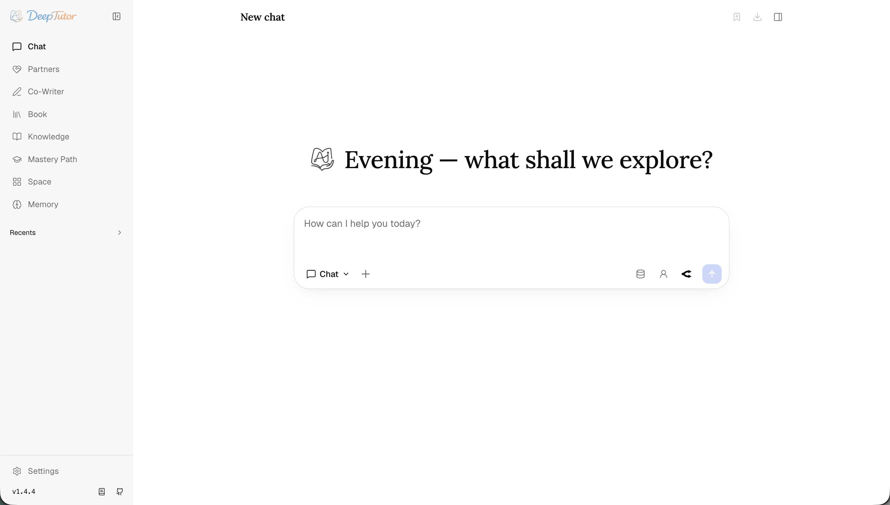
</div>

Chat default capability है और वह जगह है जहां से अधिकांश काम शुरू होता है। एक single thread normally बात कर सकता है, tools call कर सकता है, selected knowledge bases में खुद को ground कर सकता है, attachments पढ़ सकता है, notebook records लिख सकता है, और turns के पार same source inventory के साथ जारी रह सकता है।

<div align="center">
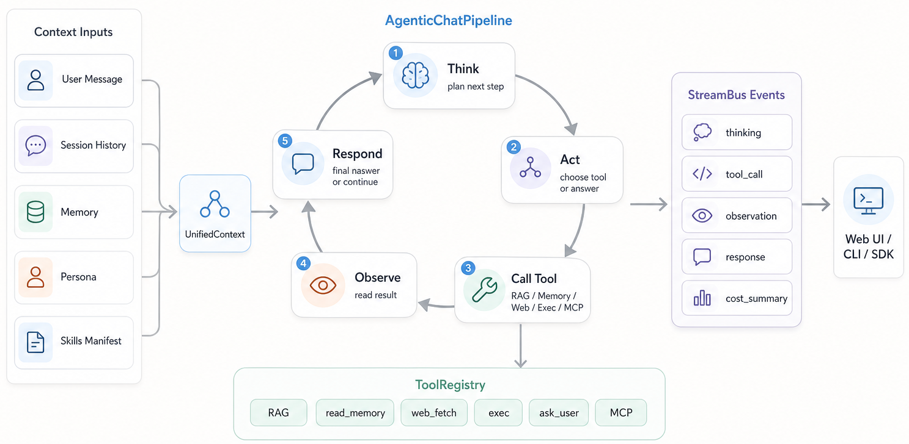
</div>

Current loop जानबूझकर simple है: model rounds में सोचता है, जब उपयोगी हो tools call करता है, tool results observe करता है, और जब पर्याप्त evidence हो तो finish करता है। User-toggleable tools हैं `brainstorm`, `web_search`, `paper_search`, और `reason`; contextual tools जैसे `rag`, `read_source`, `read_memory`, `write_memory`, `read_skill`, `load_tools`, `exec`, `web_fetch`, `ask_user`, `list_notebook`, `write_note`, और `github` तब mount होते हैं जब turn के पास सही context हो।

Chat deeper capabilities के लिए launch point भी है: worked reasoning के लिए `deep_solve`, question generation के लिए `deep_question`, cited reports के लिए `deep_research`, visual outputs के लिए `visualize` और `math_animator`, routing के लिए `auto`, और learning-plan flows के लिए `mastery_path`।

### 🤝 Partner — एक ही Brain पर Persistent Companions

<div align="center">
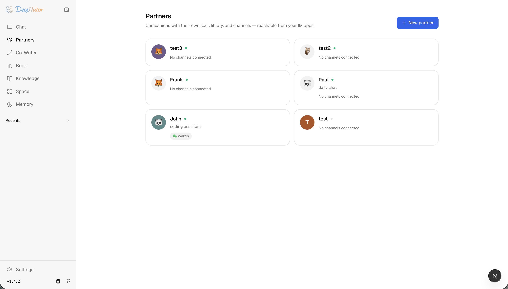
</div>

Partners पुराने TutorBot engine को एक cleaner model से replace करते हैं: हर inbound web या IM message partner-scoped workspace के अंदर एक normal ChatOrchestrator turn बन जाता है। Sync में रखने के लिए कोई अलग bot brain नहीं है।

<div align="center">
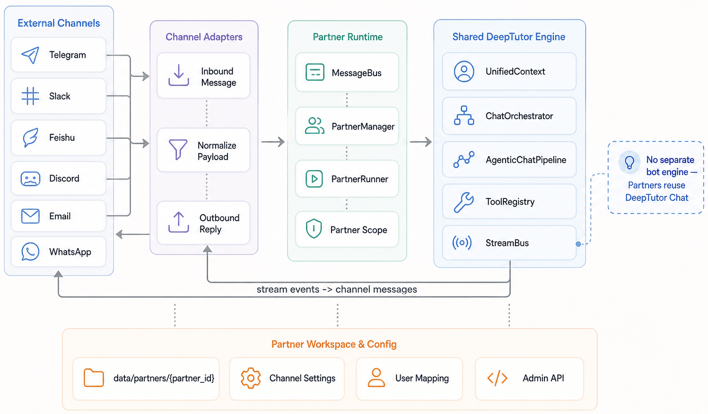
</div>

हर partner के पास एक `SOUL.md`, model selection, channels, tool policy, और assigned library है। Knowledge bases, skills, और notebooks `data/partners/<id>/workspace/` में copy होते हैं, इसलिए same RAG, skill, notebook, और memory tools special cases के बिना काम करते हैं।

<div align="center">
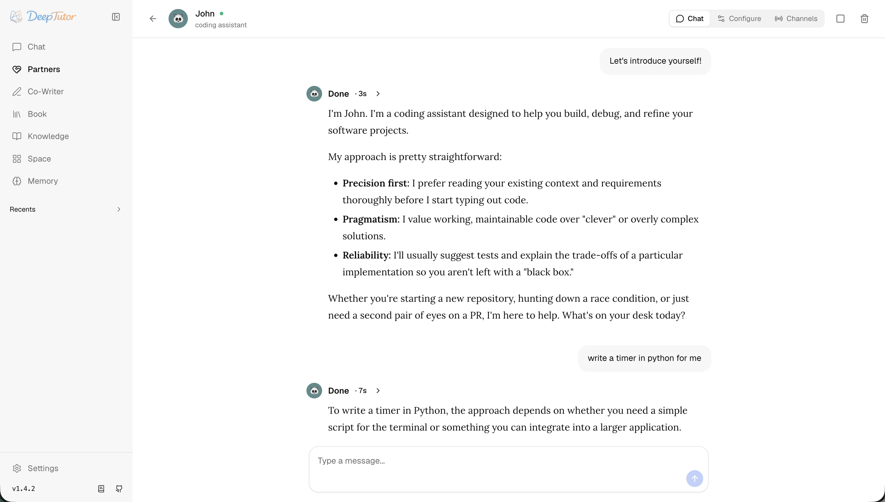
</div>

Channel layer schema-driven है और installed extras और configured credentials के आधार पर Feishu, Telegram, Slack, DingTalk, QQ/Napcat, WeCom, WhatsApp, Zulip, Matrix, और Microsoft Teams जैसे IM platforms से connect हो सकती है।

### ✍️ Co-Writer — Selection-Aware Markdown Drafting

Co-Writer reports, tutorials, notes, और long-form learning artifacts के लिए एक split-view Markdown workspace है। Documents autosave होते हैं, live preview render करते हैं, और जब draft reusable context बन जाए तो notebooks में save किए जा सकते हैं।

Text select करें और DeepTutor से rewrite, expand, या shorten करने के लिए कहें। Edit agent tool calls का एक trace रखता है और एक edit को knowledge base या web evidence में ground कर सकता है, इसलिए Co-Writer एक detached text box की बजाय retrieval के साथ एक editor की तरह व्यवहार करता है।

### 📖 Book — आपकी Materials से Living Books

<p align="center">
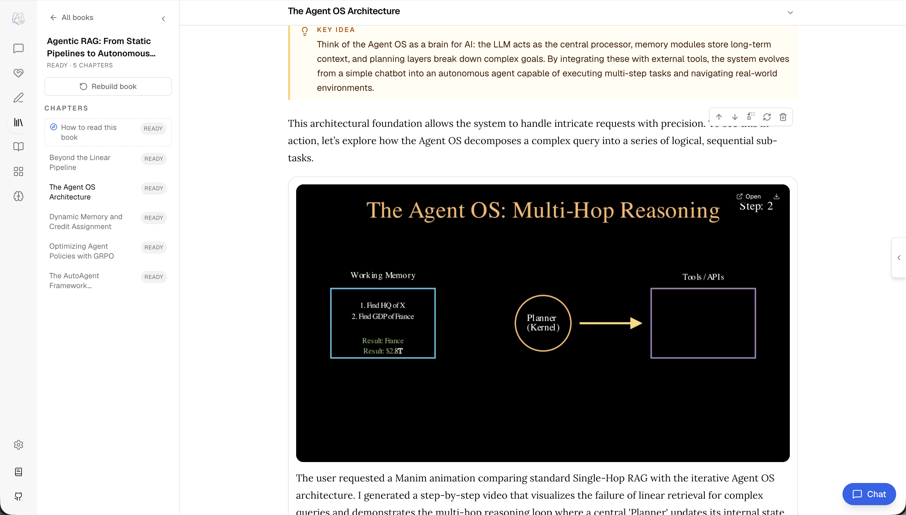
&nbsp;
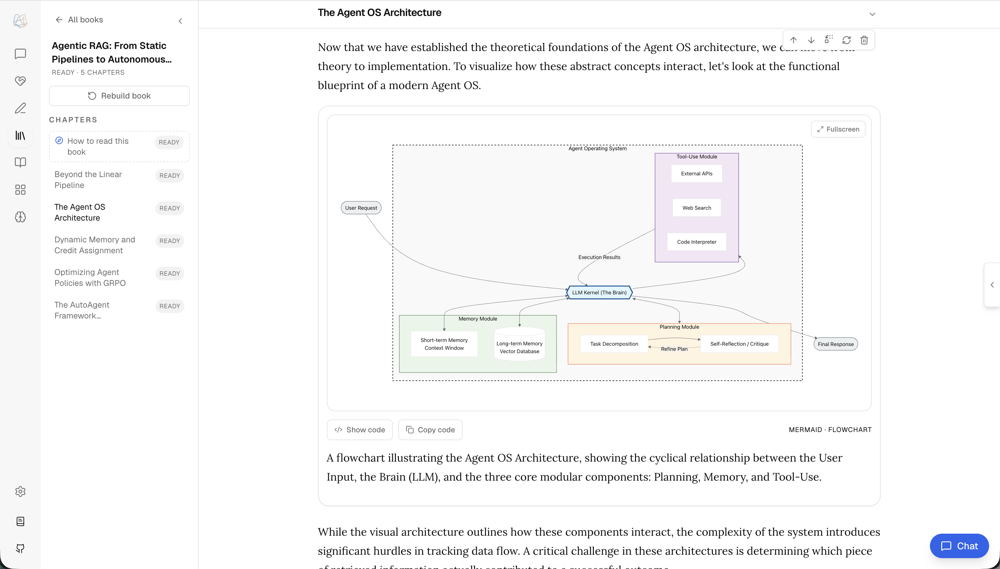
&nbsp;
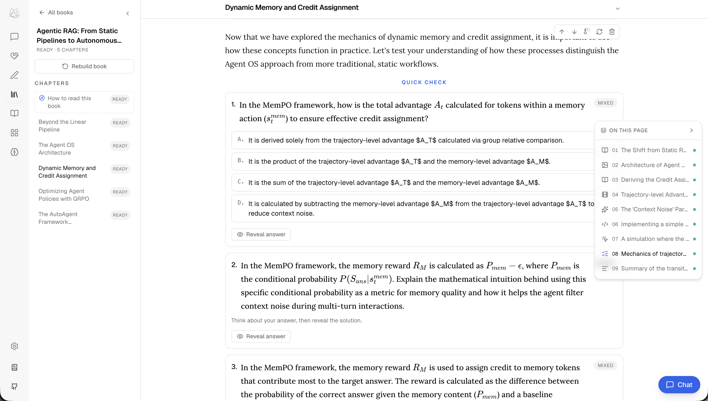
</p>

Book selected sources को interactive learning material में बदलता है। एक book knowledge bases, notebooks, question banks, या chat history से शुरू हो सकती है; creation flow content generate होने से पहले एक structure propose करता है, इसलिए users blind one-shot output accept करने की बजाय shape review कर सकते हैं।

BookEngine pages को typed blocks में compile करता है: text, sections, callouts, quizzes, flash cards, timelines, code, figures, interactive HTML, animations, concept graphs, deep dives, और user notes। Maintenance commands जैसे `deeptutor book health` और `deeptutor book refresh-fingerprints` detect करने में help करते हैं जब source knowledge compiled pages से drift हो गई हो।

### 📚 Knowledge — Versioned RAG Libraries

<div align="center">
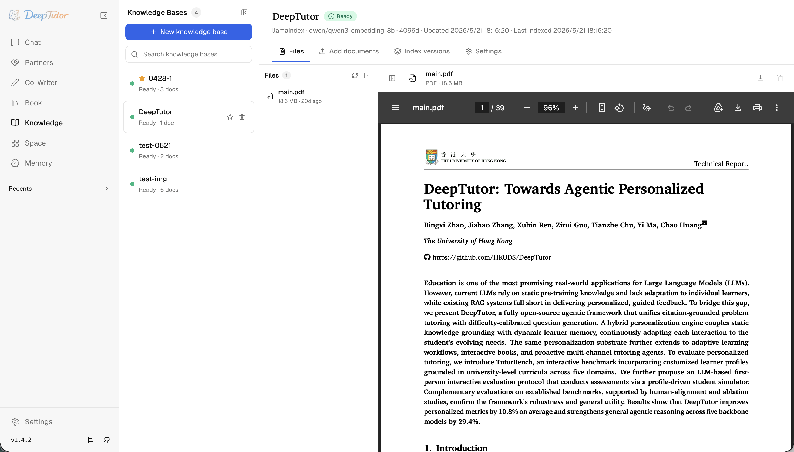
</div>

Knowledge Bases RAG के पीछे document collections हैं। Current stack LlamaIndex-only है, embedding signature द्वारा keyed flat `version-N` storage layout के साथ। Re-indexing prior versions preserve करता है और जब नए documents process होते हैं तो working index को clobber करने से बचाता है।

Web workspace files, upload, index versions, और settings expose करता है। CLI same lifecycle को `deeptutor kb list`, `info`, `create`, `add`, `search`, `set-default`, और `delete` के साथ mirror करता है।

### 🌐 Space — Skills, Personas, और Reusable Context

<div align="center">
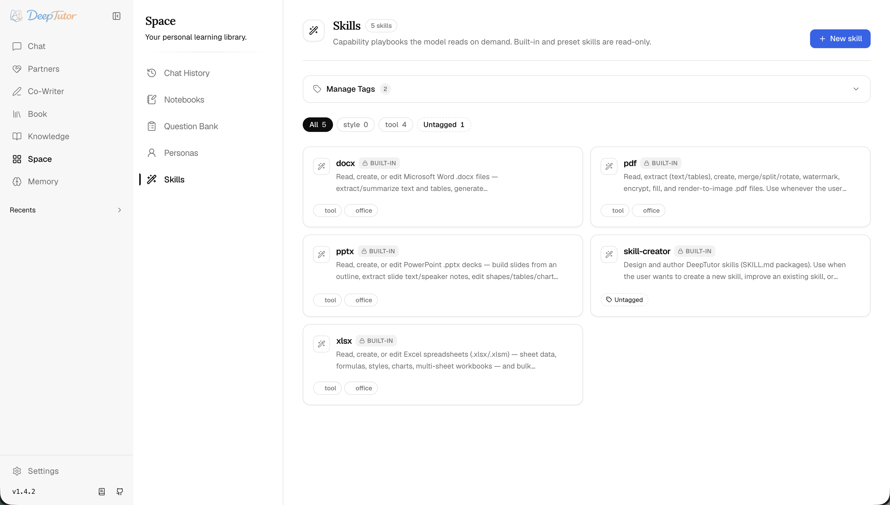
</div>

Space reusable context के लिए library layer है। यह user-authored skills, personas, notebooks, chat history, और question-bank style assets को एक साथ लाता है ताकि agent को ad hoc prompting की बजाय deliberate context के साथ steer किया जा सके।

Skills user workspace के नीचे `SKILL.md` files के रूप में stored हैं और tagged, edited, या read-only रखी जा सकती हैं जब वे built in हों। Personas role और voice के लिए same idea follow करते हैं। इन assets को partners को assign किया जा सकता है, chat में reference किया जा सकता है, और learning workflows के पार reuse किया जा सकता है।

### 🧠 Memory — Inspectable Personalization

<div align="center">
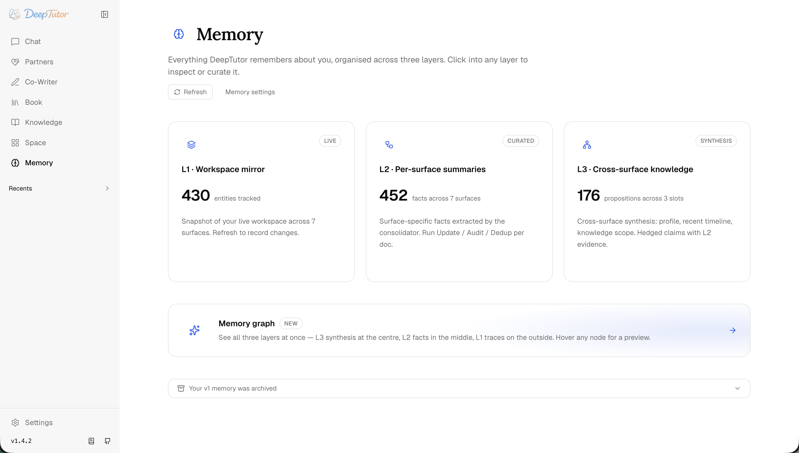
</div>

Memory एक three-layer system है जो active user workspace में rooted है: L1 event traces के लिए `trace/<surface>/<date>.jsonl`, per-surface facts के लिए `L2/<surface>.md`, और cross-surface synthesis के लिए `L3/<recent|profile|scope|preferences>.md`।

<div align="center">
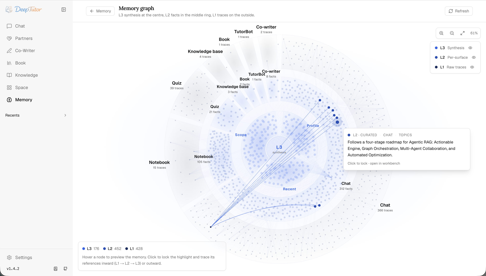
</div>

Supported memory surfaces हैं `chat`, `notebook`, `quiz`, `kb`, `book`, `tutorbot`, और `cowriter`। Legacy `tutorbot` surface name memory layer में compatibility के लिए बना रहता है भले ही product-facing companion model अब Partners है। Workbench आपको inspect, edit, consolidation run करने, और graph का उपयोग करके synthesized claims को उनके supporting facts और raw events तक trace करने देता है।

### ⚙️ Settings — एक Control Plane

<div align="center">
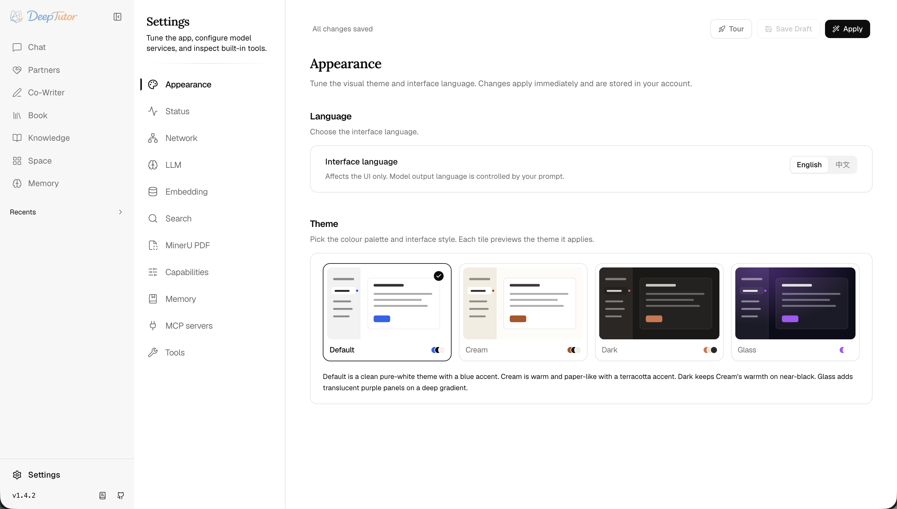
</div>

Settings operational control plane है। यह appearance, network ports और external API base, LLM और embedding catalogs, search providers, MinerU parsing, capability budgets, memory cadence, MCP servers, built-in tools, और enabled optional tool list को cover करता है।

अधिकांश settings एक draft-and-apply flow उपयोग करती हैं ताकि users providers को commit करने से पहले test कर सकें। Project-root `.env` files जानबूझकर ignored हैं; runtime configuration `data/user/settings/*.json` के नीचे रहती है जब तक कि `DEEPTUTOR_HOME` या `deeptutor start --home` app को कहीं और point न करे।

---

## ⌨️ DeepTutor CLI — एजेंट-नेटिव इंटरफेस

DeepTutor CLI-native है: same `deeptutor` entry point workspace initialize कर सकता है, web app start कर सकता है, one-shot capability run कर सकता है, interactive REPL खोल सकता है, knowledge bases manage कर सकता है, sessions inspect कर सकता है, books maintain कर सकता है, और partners operate कर सकता है।

```bash
deeptutor run chat "Explain Fourier transform" --tool rag --kb textbook
deeptutor run deep_solve "Solve x^2 = 4" --tool reason
deeptutor chat --capability deep_research --kb papers
deeptutor partner create math-tutor --soul "Socratic math tutor"
deeptutor kb create calculus --doc textbook.pdf
```

<details>
<summary><b>Command reference</b></summary>

| Command | Description |
|:---|:---|
| `deeptutor init` | Current workspace के लिए `data/user/settings` create या update करें |
| `deeptutor start [--home PATH]` | Backend + frontend को एक साथ launch करें |
| `deeptutor serve [--port PORT]` | केवल FastAPI backend start करें |
| `deeptutor run <capability> <message>` | एक single capability turn run करें (`chat`, `deep_solve`, `deep_question`, `deep_research`, `visualize`, `math_animator`, `auto`, `mastery_path`) |
| `deeptutor chat` | capability, tool, KB, notebook, और history controls के साथ Interactive REPL |
| `deeptutor partner list/create/start/stop` | IM-connected partners manage करें |
| `deeptutor kb list/info/create/add/search/set-default/delete` | LlamaIndex knowledge bases manage करें |
| `deeptutor memory show/clear` | L2/L3 memory docs inspect करें या L1/all memory clear करें |
| `deeptutor session list/show/open/rename/delete` | Shared sessions manage करें |
| `deeptutor notebook list/create/show/add-md/replace-md/remove-record` | Markdown files से notebooks manage करें |
| `deeptutor book list/health/refresh-fingerprints` | Books inspect करें और source fingerprints refresh करें |
| `deeptutor plugin list/info` | Registered tools और capabilities inspect करें |
| `deeptutor config show` | Configuration summary print करें |
| `deeptutor provider login <provider>` | जहां supported हो provider OAuth login manage करें |

</details>

CLI-only distribution `packaging/deeptutor-cli` में present है; इस checkout में इसे `python -m pip install -e ./packaging/deeptutor-cli` से source से install किया जाना चाहिए। Public `deeptutor-cli` package currently PyPI पर उपलब्ध नहीं है, इसलिए main Get Started section source-install path रखता है।

---

## 👥 मल्टी-यूजर — साझा Deployments

<div align="center">
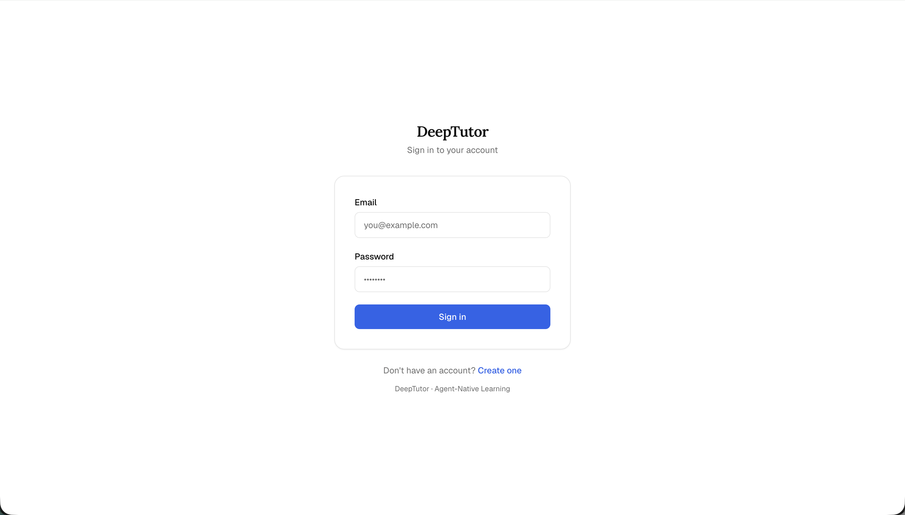
</div>

Authentication optional है और default रूप से off है। Enable होने पर, DeepTutor एक shared deployment बन जाता है जिसमें एक admin workspace, per-user workspaces, partner workspaces, और system state एक `data/` tree के नीचे होते हैं।

```text
data/
├── user/                         # Admin workspace और settings
├── users/<uid>/                  # Non-admin user scope
│   ├── user/chat_history.db
│   ├── user/settings/interface.json
│   ├── user/workspace/{chat,co-writer,book,memory,notebook,...}
│   └── knowledge_bases/...
├── partners/<id>/workspace/      # Partner synthetic-user scope
└── system/
    ├── auth/users.json
    ├── grants/<uid>.json
    └── audit/usage.jsonl
```

पहला registered user admin बनता है और model catalogs, provider credentials, knowledge bases, skills, और user grants configure कर सकता है। Non-admin users को isolated chat history, memory, notebooks, personal knowledge bases, और एक redacted Settings page मिलती है; admin-assigned resources scoped, read-only options के रूप में दिखाई देते हैं न कि API keys या provider internals expose करके।

Local trial के लिए, auth enable करने के लिए `data/user/settings/auth.json` set करें, `deeptutor start` restart करें, `/register` पर पहला admin register करें, फिर `/admin/users` से users create करें और grants के जरिए models, KBs, skills, tool policy, MCP policy, और code-execution access assign करें।

PocketBase mode इस tree में single-user integration बना रहता है; multi-user deployments को `integrations.pocketbase_url` blank रखना चाहिए और default JSON/SQLite auth और session stores उपयोग करने चाहिए जब तक कि deployment के लिए explicitly एक external user store design न किया गया हो।

---

## 🌐 समुदाय और पारिस्थितिकी तंत्र

DeepTutor outstanding open-source projects के कंधों पर खड़ा है:

| Project | DeepTutor में भूमिका |
|:---|:---|
| [**nanobot**](https://github.com/HKUDS/nanobot) | मूल TutorBot को चलाने वाला अति-हल्का agent engine (Partners अब DeepTutor के chat agent loop पर चलते हैं) |
| [**LlamaIndex**](https://github.com/run-llama/llama_index) | RAG pipeline और document indexing backbone |
| [**ManimCat**](https://github.com/Wing900/ManimCat) | Math Animator के लिए AI-driven math animation generation |

**HKUDS ecosystem से:**

| [⚡ LightRAG](https://github.com/HKUDS/LightRAG) | [🤖 AutoAgent](https://github.com/HKUDS/AutoAgent) | [🔬 AI-Researcher](https://github.com/HKUDS/AI-Researcher) | [🧬 nanobot](https://github.com/HKUDS/nanobot) |
|:---:|:---:|:---:|:---:|
| Simple & Fast RAG | Zero-Code Agent Framework | Automated Research | Ultra-Lightweight AI Agent |


## 🤝 योगदान

<div align="center">

हम आशा करते हैं कि DeepTutor community के लिए एक उपहार बने। 🎁

<a href="https://github.com/HKUDS/DeepTutor/graphs/contributors">
  
</a>

</div>

अपना development environment set up करने, code standards, और pull request workflow के guidelines के लिए [CONTRIBUTING.md](../../CONTRIBUTING.md) देखें।

## ⭐ Star History

<div align="center">

<a href="https://www.star-history.com/#HKUDS/DeepTutor&type=timeline&legend=top-left">
  <picture>
    <source media="(prefers-color-scheme: dark)" srcset="https://api.star-history.com/svg?repos=HKUDS/DeepTutor&type=timeline&theme=dark&legend=top-left" />
    <source media="(prefers-color-scheme: light)" srcset="https://api.star-history.com/svg?repos=HKUDS/DeepTutor&type=timeline&legend=top-left" />
    
  </picture>
</a>

</div>

<p align="center">
 <a href="https://www.star-history.com/hkuds/deeptutor">
  <picture>
   <source media="(prefers-color-scheme: dark)" srcset="https://api.star-history.com/badge?repo=HKUDS/DeepTutor&theme=dark" />
   <source media="(prefers-color-scheme: light)" srcset="https://api.star-history.com/badge?repo=HKUDS/DeepTutor" />
   
  </picture>
 </a>
</p>

<div align="center">

**[Data Intelligence Lab @ HKU](https://github.com/HKUDS)**

[⭐ हमें Star करें](https://github.com/HKUDS/DeepTutor/stargazers) · [🐛 Bug report करें](https://github.com/HKUDS/DeepTutor/issues) · [💬 Discussions](https://github.com/HKUDS/DeepTutor/discussions)

---

[Apache License 2.0](../../LICENSE) के तहत licensed।

<p>
  
</p>

</div>
