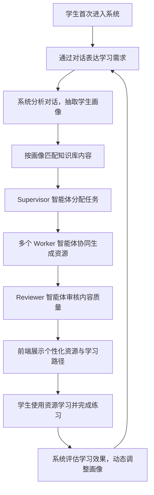

# 需求分析文档

> 中国软件杯 A3 赛题 — 基于大模型的个性化资源生成与学习多智能体系统开发

## 1. 项目概述

### 1.1 项目背景

在数字化与智能化深度融合的时代，高等教育的个性化变革成为核心发展方向。当前传统教学模式面临以下痛点：

- 不同学生在知识基础、学习能力、兴趣方向上存在显著差异，标准化教学难以满足个性化需求
- 学习资源繁杂无序，学生难以快速筛选出契合自身学习进度和能力的资源
- 课堂集体讲授模式无法兼顾每位学生的学习节奏与特点，导致知识吸收效率参差不齐
- 传统学习模式及基础智能辅助系统缺乏多模态生成、多智能体协同等前沿 AI 技术支撑

大模型技术的快速发展（通用大模型、多模态生成模型、AI 辅助编程工具等）为高等教育创新升级带来全新契机。本赛题旨在借助大模型技术体系，突破传统教育的技术与模式局限，构建高等教育个性化学习资源体系，切实满足学生的个性化、多模态学习需求。

### 1.2 项目目标

构建一个基于大模型和多智能体协同的《计算机组成原理》个性化学习智能体平台，实现：

1. 对话式学习画像自主构建，覆盖 6 个以上维度
2. 多智能体协同生成至少 5 类个性化学习资源
3. 个性化学习路径规划与动态资源推送
4. 完善的防幻觉与内容安全机制
5. 美观流畅的前端交互体验

### 1.3 样例课程

选择《计算机组成原理》作为切入课程，原因如下：

- 知识结构清晰，便于构建知识点 DAG 和学习路径
- 课程难点明显（Cache、流水线、中断、控制器、ALU 等），适合展示个性化补弱能力
- 兼具理论、硬件结构、汇编/Verilog 实践，适合生成多类型资源
- 相比泛泛的 AI 课程，更容易体现"课程知识库 + 多智能体生成 + 个性化学习"的落地价值

### 1.4 目标用户

高校修读《计算机组成原理》课程的本科学生，特征包括：

- 专业背景：计算机科学与技术、软件工程、电子信息等相关专业
- 年级分布：以大二、大三学生为主
- 典型痛点：知识体系庞杂、抽象概念理解困难、缺乏针对性练习、学习进度难以自控

## 2. 业务场景分析

### 2.1 核心业务场景



### 2.2 典型用户故事

| 场景 | 用户故事 |
| --- | --- |
| 初次画像 | 大二学生小张进入系统，通过对话告知自己是计科专业、学过数字逻辑但汇编较弱、想重点突破 Cache 和流水线、偏好图解和代码示例。系统自动生成其学习画像。 |
| 资源生成 | 系统识别小张的薄弱点为"Cache 映射方式"，Supervisor 调用 Doc Agent、MindMap Agent、Quiz Agent、Code Agent 分别生成讲解文档、思维导图、练习题和 Verilog 示例代码。 |
| 学习路径 | 小张选择"两周掌握 Cache 和流水线"目标，Planner Agent 根据知识 DAG 和其薄弱点规划学习顺序：Cache 基本原理 → 映射方式 → 流水线基础 → 流水线冲突。 |
| 练习反馈 | 小张完成一组 Cache 练习题，系统分析正确率后更新画像中"Cache 映射方式"掌握度从"较弱"提升至"中等"，并推荐进阶内容。 |

### 2.3 业务痛点与系统应对

| 痛点 | 系统应对 |
| --- | --- |
| 学习资源缺乏针对性 | 基于学生画像和知识库检索结果定向生成个性化内容 |
| 学习路径不清晰 | 基于知识点 DAG 和先修关系自动规划学习顺序 |
| 缺乏即时反馈 | 练习作答后即时判定对错、展示解析，更新画像 |
| 抽象概念难理解 | 提供图解、思维导图、代码示例等多模态资源 |
| AI 内容不可靠 | Reviewer Agent 审核 + 知识库引用溯源 + 防幻觉机制 |

## 3. 功能需求

### 3.1 对话式学习画像自主构建（P0）

**描述**：摒弃传统表单填写方式，学生通过自然语言对话表达自身学习情况，系统自动抽取并构建结构化学习画像。

**画像维度**（不少于 6 个）：

| 维度 | 说明 | 示例 |
| --- | --- | --- |
| 专业背景 | 学生所在专业 | 计算机科学与技术 |
| 知识基础 | 各前置课程掌握程度 | 数字逻辑：中等，汇编：较弱 |
| 学习目标 | 短/长期学习目标 | 两周内掌握 Cache、流水线和中断 |
| 薄弱点 | 学生自述或系统识别的弱项 | Cache 映射方式、流水线冲突 |
| 学习偏好 | 偏好的资源类型和学习方式 | 图解、例题、代码示例 |
| 学习节奏 | 可用学习时间 | 每天 1 小时 |

**画像更新机制**：

- 首次对话生成初始画像
- 练习作答结果触发画像更新
- 学生主动反馈触发画像更新
- 学习路径完成状态触发画像更新

**输入**：学生自然语言对话、练习结果、反馈信息
**输出**：结构化学生画像 JSON

### 3.2 多智能体协同的资源生成（P0）

**描述**：系统须体现多智能体架构设计，由不同角色的智能体协作完成至少 5 种类型的个性化资源生成。

**多智能体架构**（Supervisor 编排模式）：

| 编号 | Agent | 角色 | 输入 | 输出 |
| --- | --- | --- | --- | --- |
| A1 | Supervisor Agent | 任务识别与流程编排 | 用户请求、画像、检索片段 | 任务路由计划 |
| A2 | Profile Agent | 画像抽取与更新 | 学生对话、练习结果 | 学生画像 JSON |
| A3 | Doc Agent | 生成讲解文档 | 知识片段、画像、学习目标 | Markdown 讲解文档 |
| A4 | MindMap Agent | 生成思维导图 | 知识点列表、画像 | Mermaid / jsMind 数据 |
| A5 | Quiz Agent | 生成练习题 | 知识点、难度、薄弱点 | 选择题/判断题/简答题 + 解析 |
| A6 | Code Agent | 生成代码案例 | 知识点、学习目标 | Verilog/汇编/伪代码 + 逐行解释 |
| A7 | VideoScript Agent | 生成视频脚本 | 知识点、学生偏好 | 短视频脚本和分镜 |
| A8 | Reviewer Agent | 审核生成内容 | 生成结果、检索片段 | 审核结论 + 修改建议 |
| A9 | Planner Agent | 规划学习路径 | 画像、知识点 DAG、薄弱点 | 个性化路径节点列表 |

**必须生成的 5 类资源**：

1. 专业课程讲解文档（Markdown）
2. 知识点思维导图（Mermaid / jsMind）
3. 不同类型练习题目（选择题、判断题、简答题）
4. 拓展阅读材料 / 代码实操案例（Verilog / 汇编）
5. 多模态教学视频脚本（可用于视频制作的分镜脚本）

**生成流程**：

1. 学生提出学习需求
2. Supervisor 识别意图，判定所需 Agent
3. 调用 RAG 检索相关知识片段
4. Worker Agent 基于检索结果和学生画像生成内容
5. Reviewer Agent 审核生成内容的事实性和安全性
6. 审核通过后输出至前端展示

### 3.3 个性化学习路径规划和资源推送（P0）

**描述**：结合大模型对学生专业、学习进度、知识掌握情况的深度分析，为学生规划动态学习路径。

**核心能力**：

- 构建《计算机组成原理》知识点 DAG（20-30 个节点 + 先修依赖关系）
- 基于拓扑排序生成初始学习路径
- 根据学生薄弱点动态调整路径顺序和侧重点
- 对薄弱知识点增加前置或补充内容
- 基于画像实现学习资源的精准推送

**路径规划规则**：

1. 读取知识点 DAG 的先修依赖关系
2. 根据画像中的 `weak_points` 标记优先学习节点
3. 按拓扑排序生成学习顺序
4. 每个节点关联可用的多模态资源
5. 学生完成节点后更新画像，路径动态重排

### 3.4 智能辅导（可选加分项，P1）

**描述**：当学生在学习过程中遇到问题时，系统提供即时、多模态的答疑服务。

**答疑形式**：

- 详细文字解答（基于知识库检索 + 大模型生成）
- 图解说明（Mermaid 图表生成）
- 短视频讲解脚本

**输入**：学生的具体提问
**输出**：多模态解答内容

### 3.5 学习效果评估（可选加分项，P1）

**描述**：通过实时跟踪学习行为数据，实现对学生学习效果的多维度精准评估。

**评估维度**：

- 各知识点掌握度（基于练习正确率）
- 学习进度完成率
- 薄弱点改善趋势
- 资源使用偏好统计

**评估输出**：

- 掌握度雷达图（ECharts）
- 学习进度折线图
- 个性化学习建议

**动态调整**：根据评估结果自动调整资源推送策略和学习计划。

## 4. 非功能性需求

### 4.1 用户界面

| 要求 | 说明 |
| --- | --- |
| 美观大方 | 采用现代化设计风格，配色协调，布局合理 |
| 简洁明了 | 信息层级清晰，核心功能一键可达 |
| 交互流畅 | 操作响应及时，无明显卡顿 |
| 三栏布局 | 左侧学习路径树 + 中间对话区 + 右侧资源展示区 |
| 流式输出 | 对话内容采用 SSE 流式展示，避免长时间等待 |
| Markdown 渲染 | 讲解文档支持 Markdown 格式渲染 |
| 卡片化展示 | 资源以卡片形式组织，便于浏览和选择 |
| 思维导图可视化 | 支持 Mermaid / jsMind 渲染 |
| 代码高亮 | 代码块支持语法高亮和快捷复制 |
| 图表展示 | ECharts 雷达图、折线图展示学习评估 |
| 智能体状态 | 实时展示各 Agent 运行状态 |

### 4.2 性能要求

| 指标 | 要求 |
| --- | --- |
| 对话响应 | 普通文本响应 < 3s，流式首字 < 2s |
| 资源生成 | 提供"生成进度追踪"或"流式呈现"机制，避免白屏等待 |
| 知识库检索 | 检索耗时 < 1s |
| 并发支持 | 支持至少 5 个用户同时使用（演示场景） |

### 4.3 防幻觉与内容安全

| 机制 | 说明 |
| --- | --- |
| 检索增强生成 | 生成前必须调用知识库检索，携带检索片段 |
| 来源引用 | 生成结果标注引用的知识库来源 |
| Reviewer 审核 | 检查内容是否与知识库冲突、是否存在事实错误 |
| 安全过滤 | 过滤敏感违规信息 |
| 兜底策略 | 知识库无法支撑的问题返回"依据不足" |
| 二次校验 | 题目答案、代码示例、概念解释须经审核 |

### 4.4 可靠性与可用性

- 后端服务异常时，前端应有明确的错误提示和重试入口
- 大模型 API 调用失败时，提供降级方案（缓存数据 / 静态样例）
- 知识库数据需持久化存储，不因服务重启丢失

### 4.5 可维护性

- 代码结构清晰，模块化组织（后端 / 前端 / Agent 三层分离）
- Prompt 模板独立存放，便于调试和优化
- 知识点 DAG 以 JSON 配置文件形式维护
- 接口统一使用 Swagger 文档

### 4.6 开源与合规

- 使用开源项目/框架须在提交文档显著位置标注名称、来源及协议要求
- AI 辅助工具须选用科大讯飞相关工具（星火 Chat API、Embedding API）
- 其他 AI Coding 工具需在文档中说明

## 5. 技术需求

### 5.1 技术约束

| 项目 | 约束 |
| --- | --- |
| 大模型 | 须使用科大讯飞星火 API |
| 向量嵌入 | 须使用科大讯飞 Embedding API |
| 多智能体框架 | 不做限制（本项目选用 LangGraph） |
| 开发语言 | 不做限制 |
| 数据库 | 不做限制 |
| 部署平台 | 不做限制 |

### 5.2 技术选型

| 层级 | 技术 | 选型理由 |
| --- | --- | --- |
| 后端框架 | FastAPI | 异步支持好，自带 Swagger，适合 API 开发 |
| 用户认证 | JWT | 轻量无状态，适合前后端分离架构 |
| 向量数据库 | Chroma | 轻量开源，适合中小规模知识库 |
| 多智能体编排 | LangGraph | 支持有状态多 Agent 工作流 |
| 大模型 | 讯飞星火 Chat API | 赛题要求 |
| 向量生成 | 讯飞 Embedding API | 赛题要求 |
| 前端框架 | Vue3 + Element Plus | 生态成熟，组件丰富 |
| 流式输出 | SSE | 原生支持，实现简单 |
| 图表 | ECharts | 功能全面，可视化效果好 |
| 思维导图 | Mermaid / jsMind | 前端可直接渲染 |

### 5.3 系统架构约束

- 前后端分离，通过 HTTP/SSE 接口通信
- 多智能体模块独立于后端服务，可通过内部调用或独立部署
- 知识库独立存储，支持检索接口调用

## 6. 数据需求

### 6.1 课程知识库

- 覆盖《计算机组成原理》20-30 个核心知识点
- 每个知识点包含：标题、章节、正文、关键词、难度、先修依赖、来源
- 知识以向量形式存储在 Chroma 中
- 支持语义检索，返回 top-k 相关片段

### 6.2 知识点 DAG

- 定义知识点之间的先修依赖关系
- 以 JSON 格式存储
- 支持拓扑排序计算学习路径

### 6.3 学生画像

- JSON 结构存储
- 包含专业、年级、知识基础、学习目标、薄弱点、学习偏好、学习节奏等字段
- 支持增量更新

### 6.4 业务数据

- 用户信息（SQLite）
- 对话历史
- 生成资源记录
- 练习作答记录
- 学习进度数据

## 7. 接口需求

### 7.1 用户认证接口

| 接口 | 方法 | 说明 |
| --- | --- | --- |
| `/auth/register` | POST | 用户注册 |
| `/auth/login` | POST | 用户登录，返回 JWT |

### 7.2 核心业务接口

| 接口 | 方法 | 说明 |
| --- | --- | --- |
| `/chat/send` | POST | 发送消息，触发多智能体生成，支持 SSE 流式返回 |
| `/profile/get` | GET | 获取学生画像 |
| `/profile/update` | POST | 更新学生画像 |
| `/resource/generate` | POST | 按知识点和画像生成指定类型资源 |
| `/quiz/submit` | POST | 提交练习题答案 |
| `/path/get` | GET | 获取个性化学习路径 |
| `/evaluation/get` | GET | 获取学习效果评估数据 |

### 7.3 SSE 事件规范

`/chat/send` 接口的 SSE 返回事件类型：

| 事件类型 | 用途 |
| --- | --- |
| `agent_status` | 推送各 Agent 运行状态 |
| `content` | 推送生成内容（流式） |
| `resource_card` | 推送完成的资源卡片 |
| `review_result` | 推送 Reviewer 审核结果 |
| `error` | 推送错误信息 |
| `done` | 标记本次生成完成 |

## 8. 安全需求

- 用户密码加密存储
- JWT 鉴权保护业务接口
- 生成内容须经 Reviewer 安全审核
- 敏感信息过滤
- 接口防刷（演示阶段可简化）

## 9. 部署与交付需求

### 9.1 提交物清单

| 类别 | 内容 |
| --- | --- |
| 源码 | 后端代码、前端代码、Agent 编排代码 |
| 知识库 | 知识点数据、Chroma 向量库、知识点 DAG |
| 文档 | 项目方案与技术路线、需求分析文档、系统开发说明书、测试说明书、开源与 AI 工具说明 |
| 演示 | 演示 PPT、演示视频（≤ 7 分钟） |
| 配置 | 环境配置说明 |

### 9.2 提交包结构

```text
submit_package/
  source_code/
    backend/
    frontend/
    agents/
  knowledge_base/
    computer_organization/
      chunks.json
      chroma_db/
      knowledge_dag.json
  docs/
    项目方案与技术路线.md
    需求分析文档.md
    系统开发说明书.md
    测试说明书.md
    开源与AI工具说明.md
  presentation/
    演示PPT.pptx
    演示视频.mp4
  README.md
```

## 10. 验收标准

### 10.1 功能验收

- [x] 学生画像至少覆盖 6 个维度，支持对话式构建和动态更新
- [x] 多智能体架构包含 Supervisor + 至少 5 个 Worker + Reviewer
- [x] 生成至少 5 类个性化学习资源
- [x] 课程知识库覆盖 20-30 个核心知识点
- [x] 知识点 DAG 支持规划个性化学习路径
- [x] 流式输出和 Markdown 渲染正常
- [x] 防幻觉机制生效（检索增强 + 来源引用 + Reviewer 审核）

### 10.2 文档验收

- [x] 需求分析文档完整，条理清晰
- [x] 系统开发说明书覆盖后端、前端、Agent 三部分
- [x] 测试说明书覆盖接口、Agent、前端、演示用例
- [x] 开源与 AI 工具说明标注所有第三方工具和协议

### 10.3 演示验收

- [x] 演示视频 ≤ 7 分钟
- [x] 视频覆盖画像生成、知识库检索、多智能体协同、资源生成、路径规划、学习评估
- [x] PPT 重点突出多智能体架构和《计算机组成原理》课程特色

## 11. 需求优先级

| 优先级 | 需求 | 说明 |
| --- | --- | --- |
| P0 | 对话式学习画像（3.1） | 系统核心入口，必须完成 |
| P0 | 多智能体资源生成（3.2） | 赛题核心要求，必须完成 |
| P0 | 个性化学习路径（3.3） | 赛题核心要求，必须完成 |
| P0 | 防幻觉与内容安全（4.3） | 赛题明确要求 |
| P0 | 用户界面基础功能（4.1） | 演示所必需 |
| P1 | 智能辅导（3.4） | 可选加分项 |
| P1 | 学习效果评估（3.5） | 可选加分项 |

## 12. 需求变更管理

考虑到 20 天开发周期紧张，需求变更遵循以下原则：

1. P0 需求冻结后原则上不变更
2. P1 需求可依据进度动态取舍
3. 所有变更需三人协商确认
4. 优先保证最小可演示闭环的完整性
