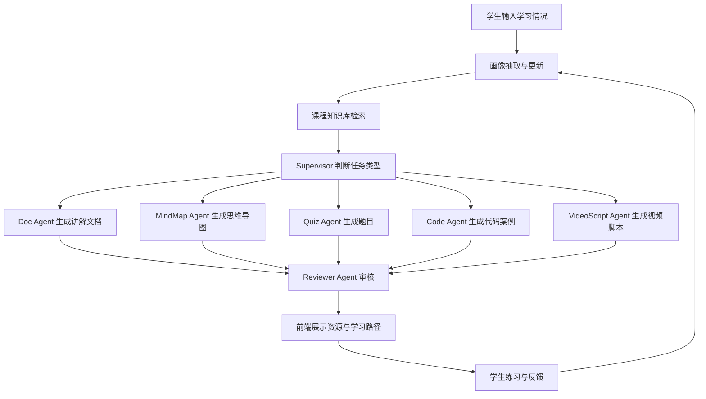
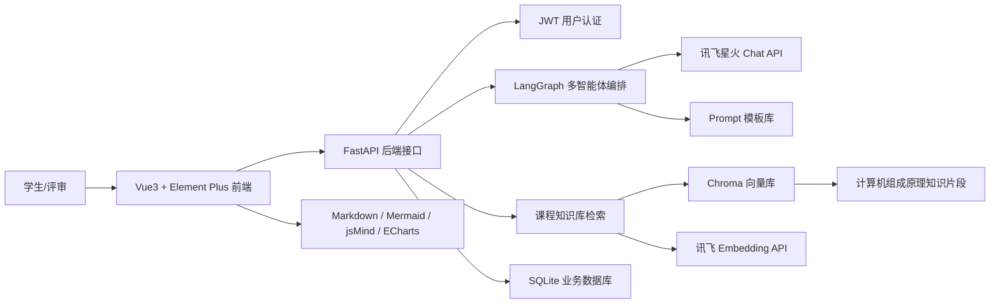

# 中国软件杯 A3 赛题项目方案与技术路线

## 1. 项目基本信息

项目名称：基于大模型的《计算机组成原理》个性化资源生成与学习多智能体系统

赛题方向：A3-基于大模型的个性化资源生成与学习多智能体系统开发

样例课程：《计算机组成原理》

团队开发周期：20 天（约 3 周）

核心技术路线：FastAPI + Vue3 + LangGraph + 讯飞星火 API + 讯飞 Embedding API + Chroma 向量知识库

## 2. 项目定位

本项目面向高校《计算机组成原理》课程学习场景，构建一个基于大模型和多智能体协同的个性化学习系统。系统通过自然语言对话理解学生基础、学习目标和薄弱点，自动生成学习画像；再结合课程知识库、多智能体资源生成和路径规划能力，为学生提供个性化讲解文档、知识点思维导图、练习题、代码示例、视频脚本和动态学习路径。

选择《计算机组成原理》作为样例课程，主要原因如下：

- 知识结构清晰，便于构建知识点 DAG 和学习路径。
- 课程难点明显，适合展示个性化补弱能力，如 Cache、流水线、中断、控制器、ALU 等。
- 课程兼具理论、硬件结构、汇编/Verilog 实践，适合生成多类型资源。
- 相比泛泛的 AI 课程，该方向更容易体现“课程知识库 + 多智能体生成 + 个性化学习”的落地价值。

## 3. 项目目标

系统目标是构建一个可运行、可演示、可扩展的《计算机组成原理》个性化学习智能体平台。

核心目标：

1. 通过对话自动抽取学生画像，至少覆盖专业背景、知识基础、学习目标、薄弱点、学习偏好、学习节奏等 6 个以上维度。
2. 构建《计算机组成原理》课程知识库，覆盖 20-30 个核心知识点。
3. 使用 LangGraph 搭建 Supervisor + 多 Worker + Reviewer 的多智能体架构。
4. 支持生成至少 5 类个性化学习资源：讲解文档、思维导图、练习题、代码案例、视频脚本。
5. 基于知识点 DAG 和学生 weak_points 生成个性化学习路径。
6. 前端完整展示聊天、学习路径、资源卡片、思维导图、练习题和学习评估。
7. 提供 7 分钟以内演示视频、PPT、系统开发说明书和测试说明书。

## 4. 核心业务流程



## 5. 总体架构

系统采用前后端分离架构，后端负责用户、知识库、大模型调用、多智能体编排和数据存储；前端负责对话交互、资源展示、学习路径可视化和演示体验。



## 6. 技术路线

| 层级 | 技术选型 | 责任成员 | 说明 |
| --- | --- | --- | --- |
| 后端框架 | FastAPI | 赵嘉诚 | 提供用户、画像、资源、聊天等接口 |
| 用户认证 | JWT | 赵嘉诚 | 支持登录注册和演示账号 |
| 知识库 | Chroma | 赵嘉诚 | 存储《计算机组成原理》向量知识库 |
| 大模型调用 | 讯飞星火 Chat API | 赵嘉诚/徐英博 | 支持普通调用和流式 SSE |
| 向量生成 | 讯飞 Embedding API | 赵嘉诚 | 将知识片段转为向量 |
| 多智能体 | LangGraph | 徐英博 | 实现 Supervisor + Workers + Reviewer |
| 路径规划 | 知识点 DAG + 拓扑排序 | 徐英博 | 根据先修关系和薄弱点生成学习路径 |
| 前端框架 | Vue3 + Element Plus | 胡博涵 | 构建页面与组件 |
| 流式输出 | SSE | 赵嘉诚/胡博涵 | 实现聊天和生成过程实时展示 |
| Markdown 渲染 | markdown-it 等 | 胡博涵 | 展示讲解文档和解析 |
| 思维导图 | jsMind / Mermaid | 胡博涵 | 展示知识结构 |
| 图表 | ECharts | 胡博涵 | 展示学习效果评估 |
| 文档与演示 | PPT + 演示视频 | 胡博涵 主导，全员配合 | 完成比赛展示材料 |

## 7. 多智能体设计

本项目采用 Supervisor 编排模式。Supervisor 负责识别用户意图、拆分任务、调用 Worker Agent，并将结果交给 Reviewer Agent 审核。

| Agent | 责任 | 输出 |
| --- | --- | --- |
| Supervisor Agent | 任务识别、流程编排、状态流转 | 调用计划、任务状态 |
| Profile Agent | 从对话中抽取和更新学生画像 | 结构化学生画像 |
| Doc Agent | 生成个性化讲解文档 | Markdown 文档 |
| MindMap Agent | 生成知识点思维导图 | Mermaid 或 jsMind JSON |
| Quiz Agent | 生成选择题、判断题、简答题和解析 | 题目 JSON |
| Code Agent | 生成 Verilog/汇编/伪代码示例 | 代码块与解释 |
| VideoScript Agent | 生成短视频讲解脚本和分镜 | 视频脚本 Markdown |
| Reviewer Agent | 校验事实性、安全性、完整性和引用依据 | 审核结果与修改建议 |
| Planner Agent | 根据知识点 DAG 生成学习路径 | 路径节点列表 |

最小演示流程中，至少展示 Supervisor、Profile、Doc、MindMap、Quiz、Code、Reviewer 共 7 个智能体。

## 8. 课程知识库规划

课程知识库围绕《计算机组成原理》构建，第一版切分 20-30 个核心知识点，每个知识点包含标题、章节、正文、关键词、难度、先修依赖和来源。

建议知识点：

1. 计算机系统概述
2. 冯·诺依曼结构
3. 数据表示与编码
4. 定点数与浮点数
5. 运算器与 ALU
6. 存储器层次结构
7. Cache 基本原理
8. Cache 映射方式
9. 主存储器
10. 指令系统
11. 寻址方式
12. CPU 基本结构
13. 控制器
14. 微程序控制
15. 指令周期
16. 流水线技术
17. 流水线冲突
18. 总线系统
19. 输入输出系统
20. 中断机制
21. DMA
22. 汇编基础
23. Verilog 基础示例
24. 性能评价指标

知识库处理流程：

1. 收集或整理教材/PDF/讲义。
2. 提取文本并清洗。
3. 按知识点切分 20-30 段。
4. 使用讯飞 Embedding API 生成向量。
5. 存入 Chroma。
6. 封装 `retrieve()` 检索函数。
7. 生成资源时强制携带检索依据。

## 9. 学生画像设计

学生画像用于驱动资源生成和路径规划。

```json
{
  "major": "计算机科学与技术",
  "grade": "大二",
  "course_goal": "两周内掌握 Cache、流水线和中断机制",
  "knowledge_base": {
    "digital_logic": "中等",
    "assembly": "较弱",
    "computer_architecture": "入门"
  },
  "weak_points": ["Cache 映射方式", "流水线冲突", "中断响应过程"],
  "learning_preference": ["图解", "例题", "代码示例"],
  "pace": "每天 1 小时",
  "resource_preference": ["思维导图", "练习题", "Verilog 示例"]
}
```

画像更新来源：

- 首次对话。
- 练习题作答结果。
- 学生反馈。
- 学习路径完成状态。

## 10. 前端产品形态

前端采用“左侧学习路径 + 中间对话区 + 右侧资源区”的三栏布局，适合 7 分钟演示时快速展示系统核心能力。

页面规划：

| 页面/区域 | 功能 |
| --- | --- |
| 登录注册页 | 演示用户进入系统 |
| 主布局 | 左侧路径树、中间对话、右侧资源卡片 |
| 聊天对话框 | SSE 流式输出、Markdown 渲染 |
| 学习路径树 | 展示个性化学习步骤和完成状态 |
| 思维导图组件 | 展示课程知识点关系 |
| 练习题组件 | 选择题作答、对错反馈、解析展示 |
| 代码展示组件 | 语法高亮、复制代码 |
| 学习评估面板 | ECharts 雷达图和折线图 |
| 智能体状态区 | 展示各 Agent 运行状态 |

## 11. 防幻觉与安全机制

系统通过以下方式降低大模型幻觉：

1. 生成前先调用 `retrieve()` 检索课程知识库。
2. Prompt 中要求回答必须基于检索片段。
3. 生成结果展示引用来源。
4. Reviewer Agent 检查内容是否与知识库冲突。
5. 对知识库无法支持的问题返回“依据不足”。
6. 对题目答案、代码示例和概念解释进行二次校验。
7. 后端记录审核结果，审核失败的内容不直接作为最终结果展示。

## 12. 团队分工总览

| 成员 | 核心职责 | 主要交付物 |
| --- | --- | --- |
| 胡博涵 | 后端架构、知识库、接口、大模型 API 封装、项目协调 | FastAPI 代码、Chroma 知识库、接口文档、后端说明 |
| 赵嘉诚（组长） | 多智能体系统、Prompt、路径规划、测试说明 | LangGraph 编排代码、Prompt 模板、知识点 DAG、测试说明书 |
| 徐英博 | 前端界面、可视化、演示材料、前端说明 | Vue3 前端、资源展示组件、演示视频、PPT、前端说明 |

协作原则：

- 前 1 周并行开发各自核心模块。
- 第 2 周集中联调与接口对接。
- 第 3 周以整体演示、文档和视频为主。
- 所有接口优先使用 Swagger 和样例 JSON 对齐。

## 13. 3 周开发路线

### 第 1 周：基础搭建与核心模块

| 时间 | 胡博涵：后端 + 知识库 | 赵嘉诚：Agent + 路径规划 | 徐英博：前端 + 演示 |
| --- | --- | --- | --- |
| 周一 | FastAPI 骨架、JWT 认证 | LangGraph 学习、Agent 架构设计 | Vue3 脚手架、登录页、主布局 |
| 周二 | 讯飞平台注册、API Key 配置 | Supervisor Agent 原型、Prompt 模板 | 聊天框、SSE 流式接收、Markdown |
| 周三 | 整理教材/PDF、切分知识点 | Doc Agent、MindMap Agent 原型 | 思维导图组件、练习题组件 |
| 周四 | Embedding 生成、Chroma 入库 | Quiz Agent、Code Agent 原型 | 代码展示、路径树组件 |
| 周五 | 封装 retrieve()、星火 Chat API | Reviewer Agent、VideoScript Agent 原型 | 资源卡片、评估面板 |
| 周六 | 核心接口（`/chat/send`、`/profile/get`） | 知识点 DAG 构建、拓扑排序 | 智能体状态展示区 |
| 周日 | 周度总结、接口规范对齐 | 周度总结、Agent 流程评审 | 周度总结、UI 评审 |

### 第 2 周：联调对接与优化

| 时间 | 胡博涵：后端 + 知识库 | 赵嘉诚：Agent + 路径规划 | 徐英博：前端 + 演示 |
| --- | --- | --- | --- |
| 周一 | `/resource/generate` 接口、流式 SSE 优化 | Agent 流程串联、状态管理 | 对接聊天与画像接口 |
| 周二 | 全流程联调（画像→检索→生成→审核） | Planner Agent、weak_points 动态路径调整 | 对接资源与路径接口 |
| 周三 | 防幻觉机制验证、引用来源展示 | Reviewer 审核逻辑完善、Prompt 精调 | 前端全流程串联、ECharts 图表 |
| 周四 | 接口异常处理、后端性能优化 | 资源生成质量优化、事实性校验 | UI 美化、交互动效 |
| 周五 | Agent 端到端测试联调 | 测试用例编写、测试说明书初稿 | 演示流程走查、操作体验优化 |
| 周六 | 修复联调问题、后端接口文档 | 修复联调问题、补充 Prompt | UI 修复、浏览器兼容 |
| 周日 | 后端压测、知识库质量评审 | Agent 流程终审 | 前端功能终审 |

### 第 3 周：演示材料与提交

| 时间 | 胡博涵：后端 + 知识库 | 赵嘉诚：Agent + 路径规划 | 徐英博：前端 + 演示 |
| --- | --- | --- | --- |
| 周一 | 后端说明文档、配合录制 | 测试说明书完善、Prompt 文档 | 演示视频脚本、开始录制 |
| 周二 | 整体联调、Bug 修复 | 整体联调、Bug 修复 | 演示视频录制 |
| 周三 | PPT 技术架构部分 | PPT 智能体设计部分 | PPT 整合与美化 |
| 周四 | 材料内部评审、修复问题 | 材料内部评审、修复问题 | 演示视频精修 |
| 周五 | 提交包整理、部署验证 | 文档补齐、代码清理 | 最终演示彩排 |
| 周六 | 提交前终审 | 提交前终审 | 提交前终审 |
| 周日 | 提交 | 提交 | 提交 |

## 14. 初赛演示脚本建议

7 分钟视频建议结构：

1. 0:00-0:40 介绍课程学习痛点和系统目标。
2. 0:40-1:30 展示登录和学生画像生成。
3. 1:30-2:30 展示知识库检索与多智能体状态。
4. 2:30-4:00 展示讲解文档、思维导图、题目、代码案例、视频脚本。
5. 4:00-5:00 展示个性化学习路径。
6. 5:00-6:00 展示练习反馈和学习评估。
7. 6:00-7:00 总结技术架构、创新点和团队分工。

## 15. 风险与应对

| 风险 | 影响 | 应对 |
| --- | --- | --- |
| 20 天周期偏紧 | 部分功能打磨不足 | 优先完成可演示闭环，P2 功能后置 |
| 讯飞 API 调用不稳定 | 影响演示 | 准备缓存样例和降级静态数据 |
| PDF 提取质量差 | 知识库效果差 | 先人工整理 20-30 个核心知识点 |
| 多智能体联调复杂 | 后端流程不稳定 | 第 2 周初开始联调，接口先用 Mock 数据 |
| 前端展示压力大 | 演示观感不足 | 优先完成主布局、资源卡片和 Agent 状态 |

## 16. 最小可行版本

20 天内必须完成的最小闭环：

1. 登录进入系统。
2. 学生输入学习情况。
3. 系统生成学生画像。
4. 检索《计算机组成原理》知识库。
5. 多智能体生成 5 类资源。
6. Reviewer Agent 审核生成内容。
7. 前端展示学习路径、资源卡片和智能体状态。
8. 学生完成练习题并看到评估结果。

完成该闭环后，项目即可支撑初赛演示和文档提交。
